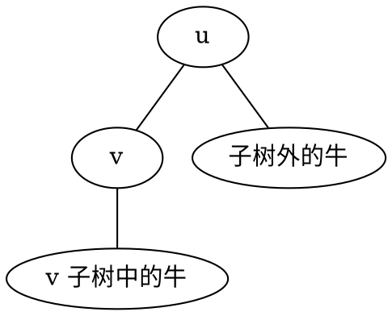

[[TOC]]

### 题意

给一棵带边权的树，每个点上有若干头牛。

要在某个点举办集会，总代价定义为：

- 每个点到集会点的距离
- 乘上该点牛数
- 再全部求和

要求输出最小总代价。

### 思路

先看一个可以直接验证想法的朴素解：

@include-code(./brute.cpp, cpp)

`brute.cpp` 把每个点都当成集会地点，重新统计整棵树的总代价。
这个方法完全正确，但复杂度是 `O(n^2)`，无法通过。

这题是很经典的换根 DP。

先固定 `1` 为根。

第一遍后序遍历要做两件事：

- 求 `sub_cows[u]`：`u` 子树的牛总数
- 求 `dist_sum[1]`：如果把 `1` 当作集会地点，总代价是多少

然后考虑换根。

如果当前已知点 `u` 的答案，想把集会地点移到儿子 `v`，边长是 `w`，那么：

- `v` 子树里的牛都会少走 `w`
- 其它牛都会多走 `w`

设整棵树牛总数为 `total_cows`，则变化量是：

`-(sub_cows[v] * w) + (total_cows - sub_cows[v]) * w`

化简得到：

`(total_cows - 2 * sub_cows[v]) * w`

于是就有：

`dist_sum[v] = dist_sum[u] + (total_cows - 2 * sub_cows[v]) * w`

有了这个公式，第二遍前序遍历就能在线性时间求出每个点作为集会地点时的总代价。

这张图展示换根时两类牛的变化方向：

从 `u` 换到 `v` 后：

- `X` 这部分整体更近
- `Y` 这部分整体更远

这就是换根公式的来源。

### 代码

@include-code(./main.cpp, cpp)

### 复杂度

总共只做两遍树上遍历。

时间复杂度是 `O(n)`，空间复杂度是 `O(n)`。

### 总结

这题最关键的一步是看清：

- 换根时，整棵树的牛只分成“子树内”和“子树外”两类

一旦把这两类距离变化写清楚，换根公式就自然出来了。
