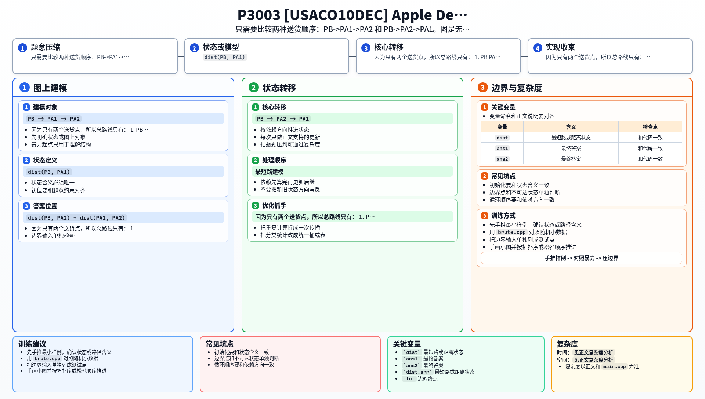

[[TOC]]

### 题意

贝茜从起点 `PB` 出发，要给 `PA1` 和 `PA2` 两个牧场送苹果。

她必须把两个点都访问到，但：

- 先去 `PA1` 再去 `PA2`
- 或先去 `PA2` 再去 `PA1`

顺序可以自己选。  
图是无向带权图，要求最小总路程。

### 思路

先看一个最直接的小数据暴力：

@include-code(./brute.cpp, cpp)

暴力做法是 Floyd：

1. 先求任意两点最短路
2. 比较两种顺序：
   - `PB -> PA1 -> PA2`
   - `PB -> PA2 -> PA1`

这个思路已经把本题本质暴露出来了：  
真正难点根本不在状态设计，而在先想明白“只有两种顺序”。

因为只有两个送货点，所以总路线只有：

1. `PB -> PA1 -> PA2`
2. `PB -> PA2 -> PA1`

因此只要知道这三个关键距离：

- `dist(PB, PA1)`
- `dist(PB, PA2)`
- `dist(PA1, PA2)`

答案就能直接写出来。

又因为图是无向图，所以：

- `dist(PA1, PA2) = dist(PA2, PA1)`

于是只需要：

1. 从 `PB` 做一次 Dijkstra，拿到 `PB` 到两个送货点的距离
2. 再从 `PA1` 做一次 Dijkstra，拿到 `PA1` 到 `PA2` 的距离

最后比较：

- `dist(PB, PA1) + dist(PA1, PA2)`
- `dist(PB, PA2) + dist(PA1, PA2)`

取更小的即可。

### 代码

@include-code(./main.cpp, cpp)

### 复杂度

做两次堆优化 Dijkstra：

- `O((P + C) log P)`

总复杂度：

- `O((P + C) log P)`

空间复杂度：

- `O(P + C)`

### 总结

这题最关键的不是最短路模板，而是先把路线顺序枚举清楚。

一旦发现只有两种顺序，问题就变成：

- 求几个关键点对之间的最短路

所以它本质上是一道“枚举顺序 + 单源最短路”的组合题。

### 一图流解析

这张图把本题的建模、关键转移、实现检查和训练方法压缩到一页，适合读完正文后复盘。

