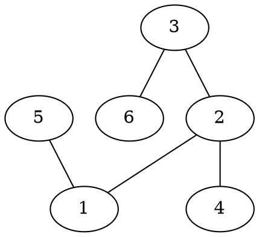
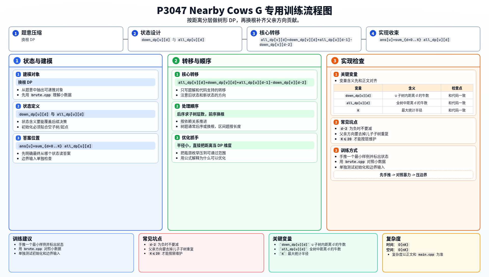

[[TOC]]

### 题意

给一棵树，每个点有若干头牛。

对于每个点 `i`，要求统计：

- 距离 `i` 不超过 `K` 的所有点上的牛数总和

### 思路

先看一个可以直接验证想法的朴素解：

@include-code(./brute.cpp, cpp)

`brute.cpp` 对每个点都做一次 BFS，统计距离不超过 `K` 的所有牛数。
这个方法完全正确，但无法处理大数据。

这题最关键的信息是：

- `K <= 20`

所以我们可以直接做“按距离分层”的树形 DP。

先定义：

- `down_dp[u][d]`：只看 `u` 子树时，与 `u` 距离恰好为 `d` 的牛数

这可以自底向上求：

- `down_dp[u][0] = cows[u]`
- 儿子 `v` 的 `d-1` 层，会贡献给 `u` 的第 `d` 层

但仅靠子树信息还不够，因为答案还包含父亲方向、兄弟子树方向的牛。

所以再定义：

- `all_dp[u][d]`：整棵树里，与 `u` 距离恰好为 `d` 的牛数

根节点直接有：

- `all_dp[1][d] = down_dp[1][d]`

然后从父亲往儿子推：

对于儿子 `v`，距离 `v` 恰好为 `d` 的牛，分成两部分：

1. `v` 子树内部的：`down_dp[v][d]`
2. 从 `u` 方向过来的：`all_dp[u][d-1] - down_dp[v][d-2]`

第二项里减去 `down_dp[v][d-2]`，是为了去掉本来就在 `v` 子树里的那部分重复贡献。

最后，把 `all_dp[u][0..K]` 全加起来，就是点 `u` 的答案。

下面这棵样例树可以帮助理解“子树内”和“父亲方向”两类来源：

比如对点 `2` 来说，距离不超过 `2` 的点既包括它自己子树里的 `1,4`，也包括往父亲和另一侧走到的 `3,5,6`。
这就是为什么只做子树 DP 不够，还需要第二遍换根传递。

#### DP 转移方程

核心状态：

`down_dp[u][d]` 与 `all_dp[u][d]`

核心转移：

`all_dp[v][d]=down_dp[v][d]+all_dp[u][d-1]-down_dp[v][d-2]`

答案收束：

`ans[u]=sum_{d=0..K} all_dp[u][d]`

### 代码

@include-code(./main.cpp, cpp)

### 复杂度

总共做两遍树上 DP，每次都要枚举 `0..K` 这一层距离。

所以时间复杂度是 `O(nK)`，空间复杂度是 `O(nK)`。

### 总结

这题最值得记住的是：

- 当树上查询的“半径”很小的时候，可以直接把距离当成 DP 维度

然后通过：

- 一遍子树 DP
- 一遍换根 DP

把整棵树的信息补完整。

### 一图流解析

这张图把本题的建模、关键转移、实现检查和训练方法压缩到一页，适合读完正文后复盘。

