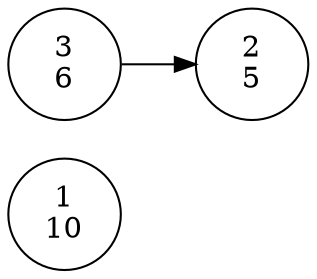
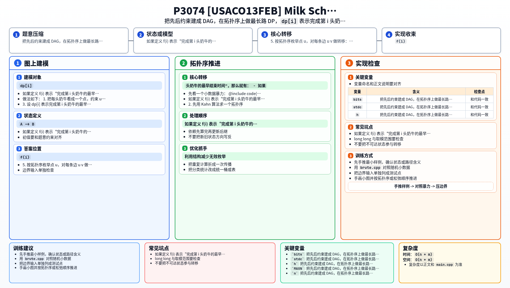

[[TOC]]

### 题意

每头奶牛挤奶都要花一定时间，同时还给出若干条先后约束：如果有一条 `A -> B`，就表示必须先把 `A` 完全挤完，才能开始挤 `B`。

题目里有很多工人，所以不受“机器数量”限制。也就是说，只要一头奶牛的所有前置任务都做完了，它就可以立刻开始。

问：满足这些先后约束的前提下，最少多久能把所有奶牛都挤完。

#### 样例图

这张图把样例中的依赖关系和每头奶牛的耗时画出来：

奶牛 `1` 和 `3` 一开始都没有前置任务，所以可以同时开始。
其中 `1` 单独完成需要 `10`，而 `3 -> 2` 这一条依赖链总耗时是 `6 + 5 = 11`。
因此最后答案不是把所有时间相加，而是看哪一条依赖链最慢。

### 思路

先看一个小数据暴力：

@include-code(./brute.cpp, cpp)

这个暴力直接枚举“以某头奶牛结尾的依赖链”，递归去找它所有前驱里最慢的那一条，再加上当前奶牛自己的耗时。

如果定义 `f(i)` 表示“完成第 `i` 头奶牛的最早结束时间”，那么就有：

- 如果 `i` 没有前驱，`f(i) = T[i]`
- 如果 `i` 有前驱，`f(i) = max(f(pre)) + T[i]`

这说明题目本质上就是：

- 点权是挤奶时间
- 边表示先后依赖
- 要求 DAG 上的最长路径

直接递归会反复算很多相同子问题，所以正式做法改成拓扑排序 + DP。

做法如下：

1. 把每头奶牛看成一个点，约束 `u -> v` 建成有向边。
2. 先用 Kahn 算法求一个拓扑序。
3. 设 `dp[i]` 表示完成第 `i` 头奶牛的最早结束时间。
4. 初始时令 `dp[i] = T[i]`。
5. 按拓扑序枚举点 `u`，对每条边 `u -> v` 做转移：

   `dp[v] = max(dp[v], dp[u] + T[v])`

6. 所有 `dp[i]` 的最大值就是答案。

代码里沿用了算法书里的 `TopologicalSort` 结构：先 `add_edge()` 建图，再 `kahn()` 取拓扑序，最后在这个顺序上做 DP。

### 代码

@include-code(./main.cpp, cpp)

### 复杂度

设点数为 `n`，边数为 `m`。

- 拓扑排序扫描每个点、每条边各一次，复杂度 `O(n + m)`
- DP 转移同样是 `O(n + m)`

总时间复杂度 `O(n + m)`，空间复杂度 `O(n + m)`。

### 总结

这题的关键不是“并行”两个字，而是要看清：在无限并行的前提下，总耗时只由最慢的依赖链决定。把题目转成 DAG 以后，就是一题非常标准的“拓扑序上的最长路 DP”。

### 一图流解析

这张图把本题的建模、关键转移、实现检查和训练方法压缩到一页，适合读完正文后复盘。

