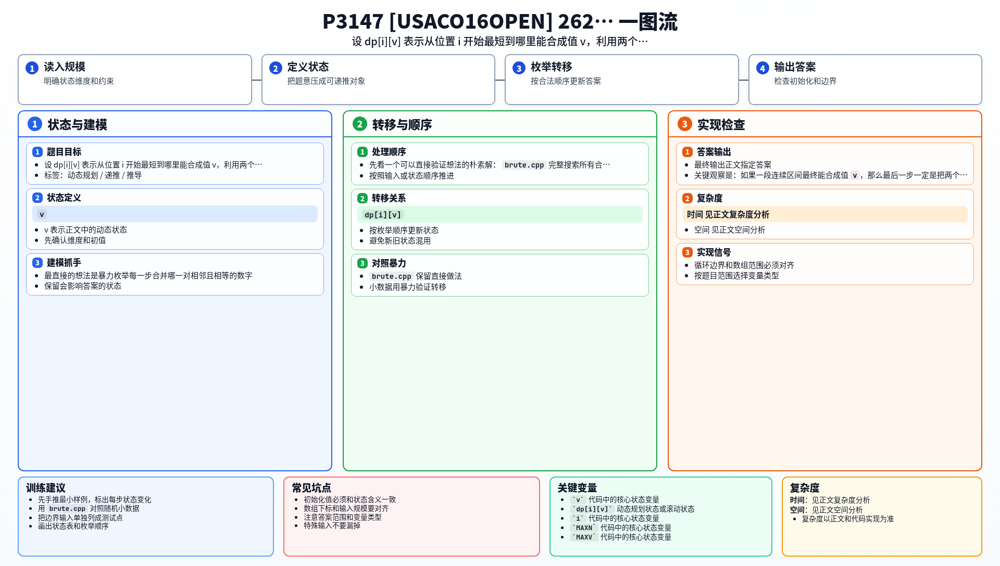

[[TOC]]

### 题意

给出一个正整数序列。每次可以把一对相邻且相等的数 `x, x` 合并成一个 `x+1`。

要求通过若干次操作，让最后能出现的最大数字尽量大。

### 思路

最直接的想法是暴力枚举每一步合并哪一对相邻且相等的数字。

先看一个可以直接验证想法的朴素解：

@include-code(./brute.cpp, cpp)

`brute.cpp` 完整搜索所有合法合并顺序，适合做小数据对拍，但正式数据下显然太慢。

关键观察是：如果一段连续区间最终能合成值 `v`，那么最后一步一定是把两个相邻的 `v-1` 合成 `v`。所以可以定义：

`dp[i][v]`

表示从位置 `i` 开始，最短到哪个位置结束，可以把这段区间合成一个值 `v`。

如果 `dp[i][v-1] = mid`，并且从 `mid+1` 开始还能再合成一个 `v-1`，那么：

`dp[i][v] = dp[mid+1][v-1]`

这张表说明几个典型状态的含义：

| 状态 | 表示什么 |
| --- | --- |
| `dp[3][1] = 3` | 第 3 个位置本来就是一个 `1` |
| `dp[2][2] = 3` | 从位置 2 到位置 3 可以合成一个 `2` |
| `dp[i][v] != 0` | 从位置 `i` 出发，某段连续区间能做出值 `v` |

读这张表时，重点是理解 `dp[i][v]` 存的不是答案值，而是“结束位置”。只要某个 `dp[i][v]` 存在，就说明值 `v` 确实能够被做出来，可以拿它更新最终答案。

#### DP 公式

设 $dp_{i,v}$ 表示从位置 $i$ 开始，最短到哪个位置结束，可以把这段区间合成一个值 $v$。若 $a_i=v$，初始化：

$$
dp_{i,v}=i
$$

若 $dp_{i,v-1}=mid$，并且 $dp_{mid+1,v-1}$ 存在，则：

$$
dp_{i,v}=dp_{mid+1,v-1}
$$

只要某个 $dp_{i,v}$ 存在，就说明值 $v$ 可以被做出，答案取最大的 $v$。

公式解释：`dp_{i,v}` 存结束位置，而不是方案数或收益。要合成值 `v`，必须先从 `i` 合成一个 `v-1`，紧接着再合成一个 `v-1`，两段相邻时才能得到 `v`。

### 代码

@include-code(./main.cpp, cpp)

### 复杂度

目标值最多增长到不到 `60`，所以状态数约为 `N * 60`，每个状态只做 `O(1)` 转移。总时间复杂度是 `O(N * 60)`，空间复杂度也是 `O(N * 60)`。

### 总结

这题的关键不是模拟合并顺序，而是把“能否做出某个值”转成一个起点 DP。抓住“值 `v` 一定由两个相邻 `v-1` 合成”这个性质，转移就非常直接。

### 一图流解析

这张图把本题的建模、关键转移、实现检查和训练方法压缩到一页，适合读完正文后复盘。

