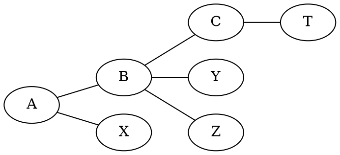

[[TOC]]

### 题意

在树中选一条简单链作为“主链”。

这条链上的点，以及所有与链上点直接相邻的点，合起来构成一个毛毛虫。
要求最大化这个毛毛虫的点数。

### 思路

先看一个只用于小数据验证的暴力：

@include-code(./brute.cpp, cpp)

`brute.cpp` 枚举路径两端点，找出整条路径，再把路径和路径旁边一层的点都统计进去。

正解的关键是把问题改写成“树上最大路径和”。

考虑一条固定主链上的点 `u`：

- 如果 `u` 是链内部点，它贡献自己，以及除了链上前后两条边之外的所有相邻点
- 如果 `u` 是链端点，它会比内部点多贡献一个端点方向

整理后可得：

- 内部点贡献 `deg(u)-1`
- 端点贡献 `deg(u)`

于是如果我们先给每个点一个基础权值：

`w[u] = deg(u)-1`

那么任意一条主链的毛毛虫大小，就等于：

- 这条路径上所有 `w[u]` 的和
- 再额外加 `2`

所以问题变成求树上的最大点权路径和。

下面这张图说明了“路径点 + 挂边点”的来源：

如果 `A-B-C` 是主链，那么 `X,Y,Z,T` 这些挂在主链上的点都会被计入答案。
这正是把每个点转成 `deg(u)-1` 权值后所表达的含义。

于是直接做树上直径式 DP：

- `down[u]`：从 `u` 出发往下走的一条最大点权链
- `ans`：经过某个点拼出的一条最大点权路径

最后输出：

- `n=1` 时答案是 `1`
- 否则答案是 `ans + 2`

### 代码

@include-code(./main.cpp, cpp)

### 复杂度

一次 DFS，时间复杂度 `O(N)`，空间复杂度 `O(N)`。

### 总结

这题最重要的不是直接枚举路径，而是先把一个点在毛毛虫中的贡献表达清楚。

一旦得到 `deg(u)-1` 这个点权，题目就直接变成了树上最大路径和问题。
