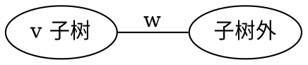
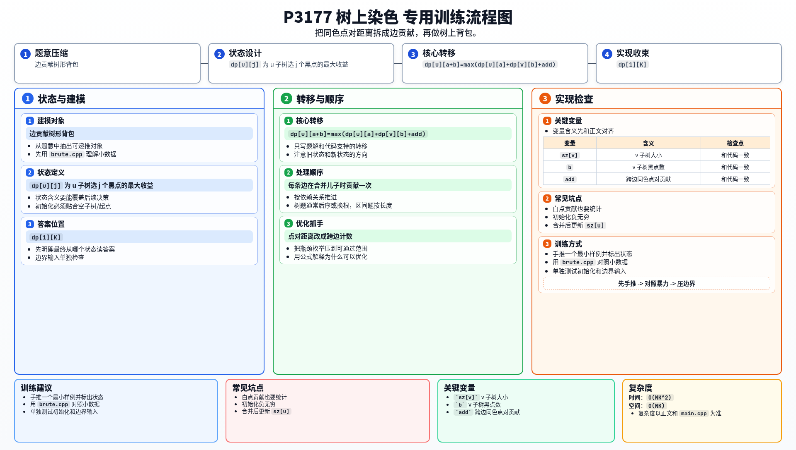

[[TOC]]

### 题意

给一棵带边权的树，恰好选 `k` 个点染成黑色，其余点染成白色。

收益定义为：

- 所有黑点两两之间的距离和
- 加上所有白点两两之间的距离和

要求最大化这个收益。

### 思路

先看一个只适合小数据验证的暴力：

@include-code(./brute.cpp, cpp)

`brute.cpp` 直接枚举黑点集合，然后按点对统计答案。
这个做法正确，但复杂度是指数级。

正解的关键是把“点对距离和”拆成“边贡献”。

考虑一条父子边 `u-v`，设 `v` 是儿子，且在 `v` 子树中选了 `b` 个黑点。

那么：

- `v` 子树外有 `k-b` 个黑点
- 跨过这条边的黑点对数量是 `b * (k-b)`

所以这条边对黑点点对的贡献是：

`b * (k-b) * w`

同理，`v` 子树中白点数是 `sz[v] - b`，子树外白点数是 `(n-k) - (sz[v]-b)`，
于是白点贡献就是：

`(sz[v]-b) * ((n-k) - (sz[v]-b)) * w`

因此可以做树形 DP：

- `dp[u][j]` 表示 `u` 子树里选 `j` 个黑点时的最大收益

合并儿子时做背包即可。

#### DP 转移方程

合并儿子 `v` 时，假设原来在已处理部分选了 `a` 个黑点，在 `v` 子树选了 `b` 个黑点。
这条边的新增贡献为：

$$
add=b(k-b)w + (sz[v]-b)((n-k)-(sz[v]-b))w
$$

因此背包合并为：

$$
dp[u][a+b]=\max(dp[u][a+b],\ dp[u][a]+dp[v][b]+add)
$$

下面这张图展示了一条边的贡献来源：

只要一对同色点分居这条边两侧，它们的距离里就会包含这条边一次。
所以我们只需要统计“跨边的同色点对数”，不需要显式计算所有点对距离。

### 代码

@include-code(./main.cpp, cpp)

### 复杂度

树形背包总复杂度 `O(NK^2)`，空间复杂度 `O(NK)`。

### 总结

这题的核心转化是：

- 不是去直接算点对距离
- 而是把点对贡献拆到每一条边上

一旦看出这一步，后面就是很标准的树上背包。

### 一图流解析

这张图把本题的建模、关键转移、实现检查和训练方法压缩到一页，适合读完正文后复盘。

