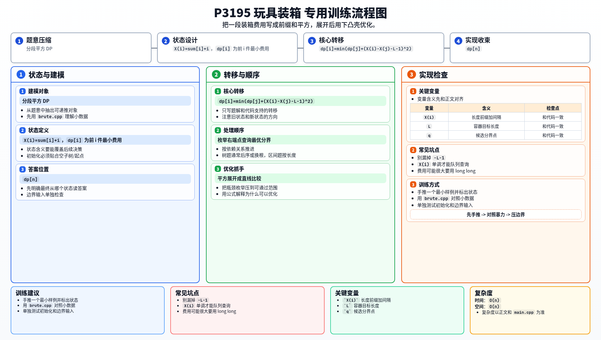

[[TOC]]

### 题意

要把 `n` 件玩具按顺序分成若干连续段，每段放进一个容器。

若一段长度是 `x`，则费用是：

`(x - L)^2`

要求总费用最小。

### 思路

先看朴素 DP：

@include-code(./brute.cpp, cpp)

设前缀和 `sum[i] = C_1 + ... + C_i`。

定义：

`X(i) = sum[i] + i`

如果最后一段是 `j+1..i`，那么这段容器长度减去 `L` 后，正好是：

`X(i) - X(j) - L - 1`

于是：

`dp[i] = min(dp[j] + (X(i) - X(j) - L - 1)^2)`

展开平方：

`dp[i] = X(i)^2 + min(dp[j] + (X(j)+L+1)^2 - 2X(i)(X(j)+L+1))`

这已经是标准斜率优化形式。

又因为 `X(i)` 单调递增，所以可以用单调队列维护候选决策点。

#### DP 转移方程

核心状态：

`X(i)=sum[i]+i`，`dp[i]` 为前 i 件最小费用

核心转移：

`dp[i]=min(dp[j]+(X(i)-X(j)-L-1)^2)`

答案收束：

`dp[n]`

### 代码

@include-code(./main.cpp, cpp)

### 复杂度

时间复杂度 `O(n)`，空间复杂度 `O(n)`。

### 总结

这题是非常典型的“分段平方代价 DP -> 展开平方 -> 斜率优化”。

记住 `X(i) = sum[i] + i` 这一步，后面的形式就会很自然。

### 一图流解析

这张图把本题的建模、关键转移、实现检查和训练方法压缩到一页，适合读完正文后复盘。

