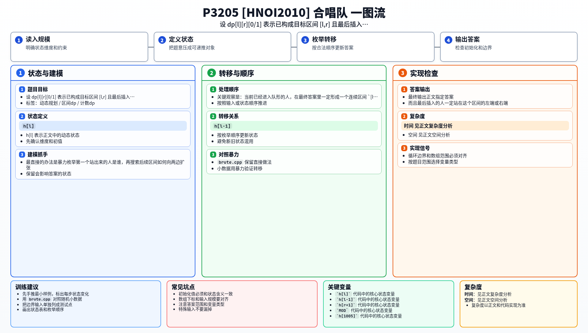

[[TOC]]

### 题意

给出最终理想队形的身高序列。

每次按初始顺序依次取人：第一个人直接入队；之后每个人如果比前一个人高，就插到当前队形最右边，否则插到最左边。

要求统计有多少种初始顺序，最终能得到给定的理想队形。

### 思路

最直接的办法是暴力枚举第一个站出来的人是谁，再搜索后续区间如何向两边扩张。

先看一个可以直接验证想法的朴素解：

@include-code(./brute.cpp, cpp)

`brute.cpp` 会直接搜索：

- 当前已经构成的目标区间 `[l, r]`
- 上一个插入的人是谁
- 下一步能不能从左边扩、能不能从右边扩

这个想法很直观，但不记忆化会反复遇到相同的区间状态。

关键观察是：当前已经进入队形的人，在最终答案里一定形成一个连续区间 `[l, r]`。而且最后插入的人一定站在这个区间的左端或右端。

于是设：

- `dp[l][r][0]`：已经构成 `[l, r]`，且最后插入的人在左端
- `dp[l][r][1]`：已经构成 `[l, r]`，且最后插入的人在右端

从 `dp[l][r][0]` 出发，当前“前一个人”就是 `h[l]`：

- 如果左边还有人且 `h[l-1] < h[l]`，就能把 `h[l-1]` 插到左边
- 如果右边还有人且 `h[r+1] > h[l]`，就能把 `h[r+1]` 插到右边

`dp[l][r][1]` 同理。

这张表展示状态的含义：

| 状态 | 表示什么 |
| --- | --- |
| `dp[3][3][0]` | 只选了第 3 个人作为起点 |
| `dp[2][5][0]` | 已经构成目标区间 `[2, 5]`，最后插入的人是左端 `2` |
| `dp[2][5][1]` | 已经构成目标区间 `[2, 5]`，最后插入的人是右端 `5` |

读这张表时，关键是抓住两点：当前队形对应最终答案中的一段连续区间；而题目里比较大小时用到的“前一个人”，就是这段区间最后插入的那个端点。

#### DP 公式

设 $dp_{l,r,0}$ 表示已经构成区间 $[l,r]$，且最后插入的人在左端；$dp_{l,r,1}$ 表示最后插入的人在右端。若最后插入的人在左端，则当前比较值是 $h_l$：

$$
dp_{l-1,r,0}\mathrel{+}=dp_{l,r,0}\quad (h_{l-1}<h_l)
$$

$$
dp_{l,r+1,1}\mathrel{+}=dp_{l,r,0}\quad (h_{r+1}>h_l)
$$

若最后插入的人在右端，则把比较值换成 $h_r$ 做同样转移。最终答案为：

$$
dp_{1,n,0}+dp_{1,n,1}
$$

公式解释：当前已形成的人一定对应目标队形中的连续区间。最后插入者决定下一次比较的身高，所以状态要额外记录最后插入在左端还是右端。

### 代码

@include-code(./main.cpp, cpp)

### 复杂度

状态数是 `O(n^2)`，每个状态只有常数个转移，所以时间复杂度是 `O(n^2)`，空间复杂度也是 `O(n^2)`。

### 总结

这题的关键不是直接还原整个初始序列，而是把过程抽成“连续区间向两边扩张”的计数 DP。只要状态定义对了，转移就很直接。

### 一图流解析

这张图把本题的建模、关键转移、实现检查和训练方法压缩到一页，适合读完正文后复盘。

