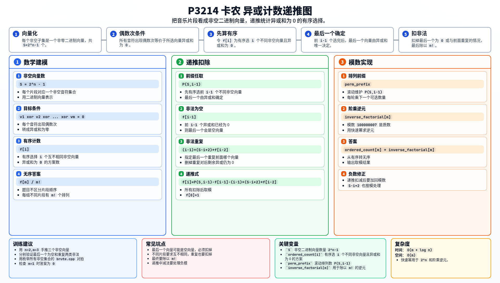

[[TOC]]

### 题意

有 `n` 个音阶，一个音乐片段是若干个音阶组成的非空集合。现在要选出 `m` 个互不相同的片段，片段顺序不计，并要求每个音阶总共出现偶数次。求方案数。

### 思路

把每个片段看成一个 `n` 位二进制向量：某一位为 `1` 表示包含这个音阶。每个音阶出现偶数次，等价于选出的所有向量异或和为 `0`。

朴素做法是在小数据下枚举所有非空集合，再枚举其中大小为 `m` 的子集检查异或和。

先看一个可以直接验证想法的朴素解：

@include-code(./brute.cpp, cpp)

设非空向量总数为：

```text
S = 2^n - 1
```

令 `f[i]` 表示有序选择 `i` 个互不相同的非空向量，且异或和为 `0` 的方案数。最后答案要除以 `m!`，因为题目不区分片段顺序。

为了递推 `f[i]`，先任意有序选择前 `i-1` 个不同非空向量，方案数是 `P(S,i-1)`。若总异或和要为 `0`，第 `i` 个向量会被前面向量的异或和唯一确定。

这个唯一确定的向量可能非法：

- 它是空向量：说明前 `i-1` 个向量异或和已经为 `0`，有 `f[i-1]` 种；
- 它与前面某个向量重复：指定重复的是前面第几个向量，再删掉这一对相同向量，剩下 `i-2` 个向量异或和仍为 `0`。数量为 `(i-1) * (S-i+2) * f[i-2]`。

所以：

```text
f[0] = 1
f[i] = P(S,i-1) - f[i-1] - (i-1)*(S-i+2)*f[i-2]
```

最终答案：

```text
f[m] / m!
```

模数 `10^8+7` 是质数，除法用阶乘逆元实现。

### 代码

@include-code(./main.cpp, cpp)

### 复杂度

时间复杂度 `O(m + log n)`。

空间复杂度 `O(m)`。

### 总结

这题的关键转换是“偶数次出现”等价于二进制向量异或和为 `0`。递推时先让最后一个向量由前缀唯一确定，再扣掉空向量和重复向量两类非法情况。

### 一图流解析

这张图把本题的建模、关键转移、实现检查和训练方法压缩到一页，适合读完正文后复盘。


