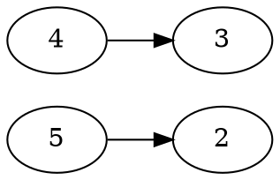
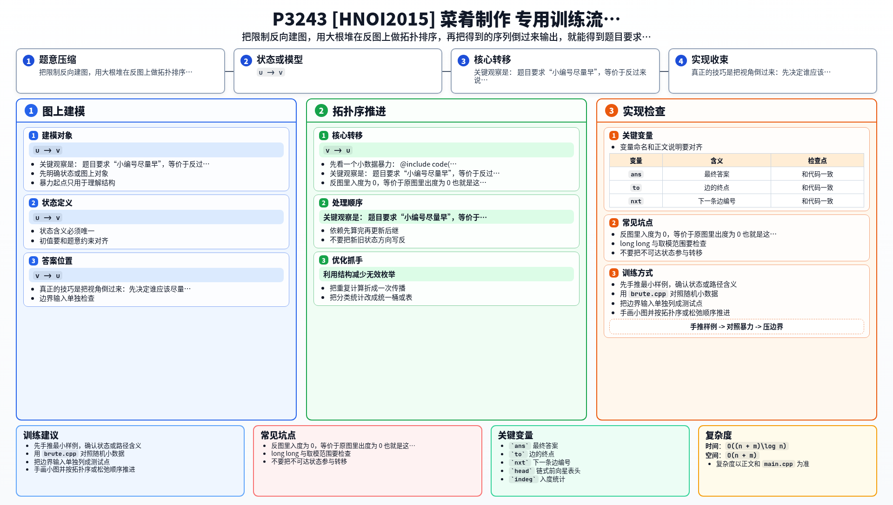

[[TOC]]

### 题意

给出若干道菜以及一些先后限制 `(u, v)`，表示菜 `u` 必须在菜 `v` 之前制作。

现在要在满足所有限制的前提下，找出一个“最优”的制作顺序。这里的“最优”不是普通的字典序最小，而是：

- 先让 `1` 号菜尽量早
- 在此基础上让 `2` 号菜尽量早
- 再在前面都最优的基础上让 `3` 号菜尽量早
- 依此类推

如果无解，就输出 `Impossible!`。

#### 样例图

这张图展示第三组样例中的限制关系：

如果只看普通的“当前可选编号最小”，会得到 `1 4 3 5 2`，这不是题目想要的答案。
题目真正想要的是先尽量让 `1` 靠前，再尽量让 `2` 靠前，所以正确顺序是 `1 5 2 4 3`。
这说明它不是普通的最小字典序拓扑序。

### 思路

先看一个小数据暴力：

@include-code(./brute.cpp, cpp)

暴力会枚举所有拓扑序，然后按照题目给出的比较规则选最优的那个：

- 先比较 `1` 的位置
- 若相同，再比较 `2` 的位置
- 继续往后比

这个方法可以帮助理解题意，但正解不能真的枚举所有拓扑序。

关键观察是：

题目要求“小编号尽量早”，等价于反过来说：

- 在还没确定前面位置时，应该尽量把“大编号且当前不影响别人”的点放到后面去

因此可以换一个角度做：

1. 把原图限制 `u -> v` 反过来，建成 `v -> u`
2. 在反图上做拓扑排序
3. 每次从当前入度为 `0` 的点里，选编号最大的那个
4. 最后把得到的序列整体反过来输出

为什么这样是对的？

- 反图里入度为 `0`，等价于原图里出度为 `0`
- 也就是这些点在原图里已经可以尽量往后放，不会卡住别人
- 此时把编号大的点优先放到后面，等价于把编号小的点尽量留在前面

于是：

- 反图 + 大根堆：决定“后面的位置怎么放”
- 最终倒序输出：得到“前面的位置怎么尽量优”

如果反图拓扑排序做不满 `n` 个点，说明原图有环，无解。

### 代码

@include-code(./main.cpp, cpp)

### 复杂度

设点数为 `n`，边数为 `m`。

- 建图 `O(n + m)`
- 大根堆拓扑排序 `O((n + m)\log n)`

总时间复杂度 `O((n + m)\log n)`，空间复杂度 `O(n + m)`。

### 总结

这题最容易误判成“字典序最小拓扑序”。真正的技巧是把视角倒过来：先决定谁应该尽量靠后，再把答案翻转回来。于是题目就落成了“反图上的大根堆拓扑排序”。

### 一图流解析

这张图把本题的建模、关键转移、实现检查和训练方法压缩到一页，适合读完正文后复盘。

