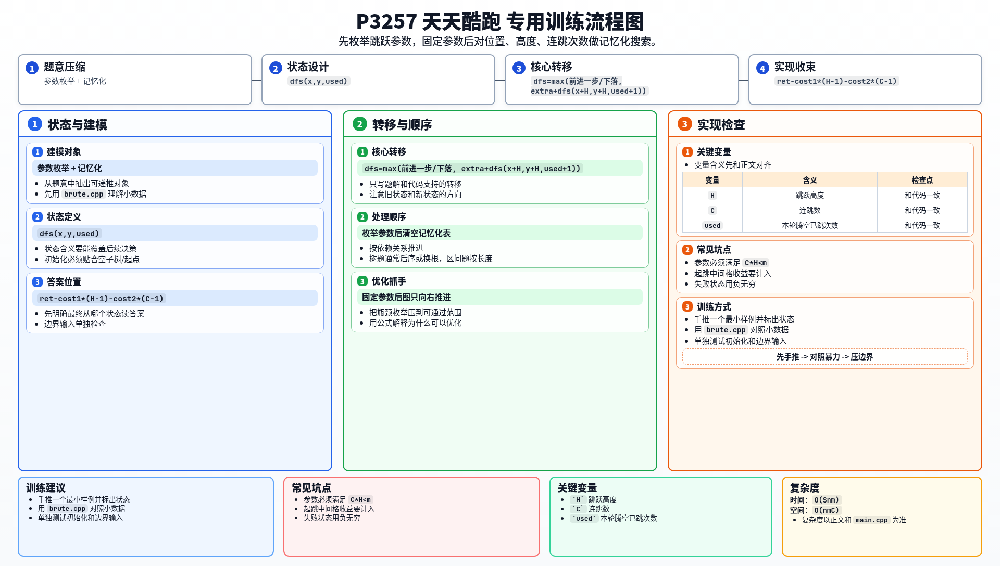

[[TOC]]

### 题意

在一个 `n x m` 的地图里，从起点 `(0,1)` 跑到终点线右侧。

每个格子有收益，`-1` 表示这个点不能经过。

开始前要先确定两件事：

1. 跳跃高度 `H`
2. 连跳数 `C`

升级这两个参数都要花费分数：

- 跳跃高度每升一级花 `cost1`
- 连跳数每升一级花 `cost2`

问最终最大净收益是多少，并输出对应的最小连跳数、最小跳跃高度。

如果无论如何都跑不出终点，就输出 `mission failed`。

### 思路

先看一个可以直接验证想法的朴素解：

@include-code(./brute.cpp, cpp)

这题最麻烦的地方在于：跳跃高度和连跳数不是过程中的决策，而是开始前一次性设定好的。

因此最自然的处理方式是：

1. 先枚举跳跃高度 `H`
2. 再枚举连跳数 `C`
3. 在固定 `(H, C)` 的前提下，求一条最优路径

接下来只看固定参数下怎么做。

把状态记成：

- 当前横坐标 `x`
- 当前高度 `y`
- 这一轮腾空过程中已经用了多少次跳跃 `used`

如果当前在地面：

1. 可以继续向前跑一格
2. 可以开始一次跳跃

如果当前在空中：

1. 可以继续下落一格
2. 如果还没超过连跳次数，就可以再次起跳

注意这里的“再次起跳”是从当前位置再斜着向右上跳 `H` 格，中间经过的上升点收益要一起算进去。

这就形成了一个只向右转移的多段图，所以可以直接做记忆化搜索。

#### 记忆化转移方程

固定 `(H,C)` 后，设 `dfs(x,y,used)` 表示从当前位置继续跑到终点线右侧的最大额外收益。
主要转移有两类：

$$
dfs(x,y,used) \leftarrow dfs(x+1,y',used')
$$

表示继续向右跑或在空中下落；若还能继续跳，则：

$$
dfs(x,y,used) \leftarrow extra + dfs(x+H,y+H,used+1)
$$

其中 `extra` 是起跳过程中经过的中间格收益。
每组 `(H,C)` 求出的路径收益还要减去升级费用。

再注意一个合法性约束：

- 既然设定好参数后必须保证不会跳出高度上限

那么只需要枚举满足：

- `C * H < m`

的参数组合即可。

对于每组 `(H, C)`，求出最大路径收益后，再减去升级代价：

- `cost1 * (H - 1) + cost2 * (C - 1)`

最后按题意要求比较：

1. 净收益最大
2. 若净收益相同，连跳数最小
3. 若还相同，跳跃高度最小

### 代码

@include-code(./main.cpp, cpp)

### 复杂度

设可枚举的参数组数量为 `S`。

对每组 `(H, C)`，状态数大约是：

- `O(n * m * C)`

而 `m <= 20`、`C <= 5`，状态非常小。

总复杂度可以看作 `O(Snm)`，在本题范围内可以通过。

### 总结

这题的关键有两层：

1. 开始前先枚举固定的跳跃参数
2. 固定参数后，把过程看成一个只会向右推进的记忆化搜索

本质上是“参数枚举 + 小状态 DP”的组合题。

### 一图流解析

这张图把本题的建模、关键转移、实现检查和训练方法压缩到一页，适合读完正文后复盘。

