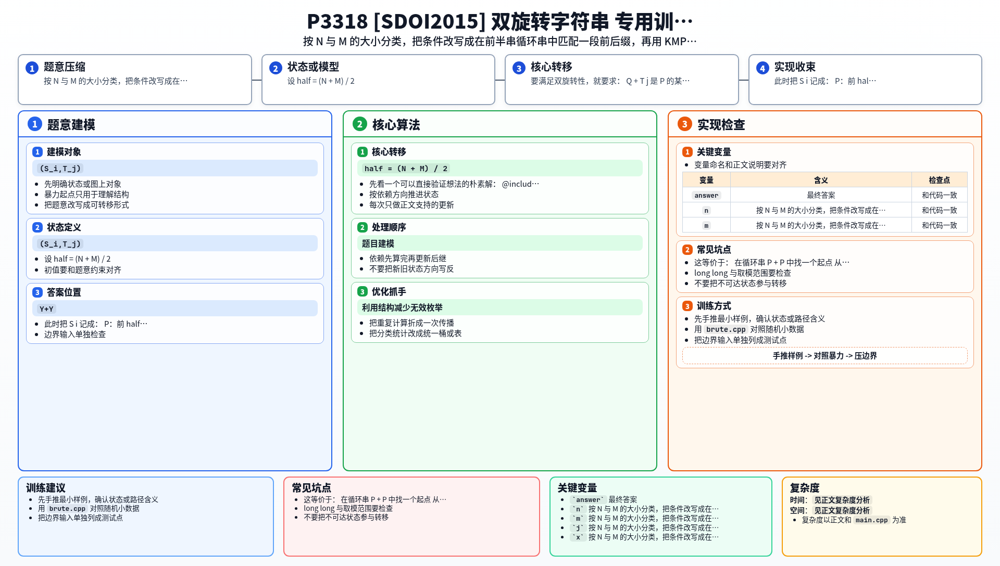

[[TOC]]

### 题意

给定两个字符串集合 `S` 和 `T`。

- `S` 中每个字符串长度都是 `N`
- `T` 中每个字符串长度都是 `M`
- `N + M` 一定是偶数

要求统计有多少对 `(S_i, T_j)`，使得拼接串 `S_i + T_j` 的前一半和后一半长度相同，并且后一半可以由前一半旋转得到。

### 思路

先看一个可以直接验证想法的朴素解：

@include-code(./brute.cpp, cpp)

暴力做法就是枚举每一对 `(S_i,T_j)`，拼起来后把前半段和后半段取出，再判断它们是否互为旋转。这个方法复杂度太高，只适合很小的数据。

设 `half = (N + M) / 2`。

核心在于按 `N` 和 `M` 的大小关系分情况建模。

#### 情况一：`N >= M`

此时把 `S_i` 记成：

- `P`：前 `half` 个字符
- `Q`：后 `N-half` 个字符

拼接后前半段就是 `P`。  
后半段则是 `Q + T_j`。

要满足双旋转性，就要求：

`Q + T_j` 是 `P` 的某个旋转。

这等价于：

- 在循环串 `P + P` 中找一个起点
- 从这个起点开始长度 `N-half` 的那一段必须等于 `Q`
- 紧随其后的长度 `M` 的那一段就是候选 `T_j`

所以对每个 `S_i`，我们只需要：

1. 在 `P+P` 中找 `Q` 的所有出现位置
2. 每个出现位置导出一个候选 `T`
3. 看这个候选 `T` 是否在集合 `T` 中出现

为了高效找 `Q` 的出现位置，使用 KMP；为了高效查候选串是否在 `T` 集合中，使用哈希。

#### 情况二：`N < M`

完全对称地处理 `T_j`。

把 `T_j` 记成：

- `X`：前 `half-N` 个字符
- `Y`：后 `half` 个字符

此时后一半就是 `Y`，前一半是 `S_i + X`。  
要求前一半是 `Y` 的某个旋转。

于是转成：

1. 在 `Y+Y` 中找 `X` 的出现位置
2. 由这些位置反推出候选 `S`
3. 在集合 `S` 中查有没有这个候选

两种情况都只需要做：

- KMP 找匹配位置
- 哈希取候选子串
- 对同一个原串产生的重复候选去重
- 用哈希表统计另一侧集合中的出现次数

这样就可以在线性级别处理所有字符串内容。

### 代码

@include-code(./main.cpp, cpp)

### 复杂度

设所有字符串总长度为 `Lsum`。

每个字符串只会被做常数次：

- 构造循环串
- 跑一次 KMP
- 对若干匹配位置取哈希并查表

因此总时间复杂度可以看作 `O(Lsum + 匹配位置总数)`，实际实现中再加上一点去重排序的代价。  
空间复杂度是 `O(Lsum)`。

### 总结

这题最重要的是把“前半和后半互为旋转”拆开，并根据 `N`、`M` 的大小关系，把问题压缩成：

- 在一个循环串里找固定前后缀关系
- 由匹配位置反推出另一侧字符串

本质上是字符串建模 + KMP + 哈希的组合题。

### 一图流解析

这张图把本题的建模、关键转移、实现检查和训练方法压缩到一页，适合读完正文后复盘。

