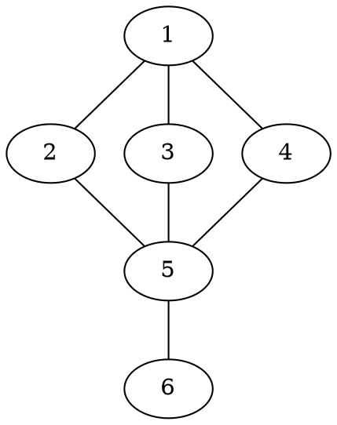

[[TOC]]

### 题意

给一张无向图，要求输出所有割点。

割点的意思是：

- 删除这个点以及和它相连的所有边以后
- 整张图的连通块数量会变多

题目还特别提醒了一句：

- 图不一定连通

所以最终代码不能只从 `1` 号点搜一遍，而要把所有连通块都处理到。

#### 样例图

这张图把样例画出来：

从图上可以看到，点 `5` 连着点 `6` 这条尾巴。
如果删掉点 `5`，点 `6` 就彻底和其他点断开，所以 `5` 是割点。
而删掉 `1`、`2`、`3`、`4` 中任意一个，剩下部分仍然连通，因此它们不是割点。

### 思路

先看一个最直接的小数据暴力：

@include-code(./brute.cpp, cpp)

暴力的想法是：

1. 依次假设删掉一个点 `u`
2. 重新统计删点后的连通块个数
3. 如果连通块数量变多，`u` 就是割点

这个方法容易理解，但每个点都要重新搜一遍图，复杂度太高。

正式做法就是你书里的 Tarjan 割点模板。

设 `u` 在 DFS 树里有一个儿子 `v`。如果：

`low[v] >= dfn[u]`

说明 `v` 这棵子树无法绕过 `u` 回到 `u` 的祖先。
那么一旦删掉 `u`，`v` 子树就会和外界断开，所以 `u` 是割点。

这里要分两种情况：

1. `u` 不是 DFS 根  
   只要存在一个儿子 `v` 满足 `low[v] >= dfn[u]`，`u` 就是割点。

2. `u` 是 DFS 根  
   根没有祖先，判定方式不一样。只有当根在 DFS 树里有至少两个儿子时，删掉它才会把这些子树分开。

所以这题最容易错的地方不是公式，而是：

- 根节点要单独判断
- 图不一定连通，要从每个未访问点重新开 DFS

### 代码

@include-code(./main.cpp, cpp)

### 复杂度

每个点访问一次，每条无向边最多看两次，所以：

- 时间复杂度 `O(n+m)`
- 空间复杂度 `O(n+m)`

### 总结

这题是标准割点模板题，核心记忆点只有两个：

1. 非根节点看 `low[v] >= dfn[u]`
2. 根节点看 DFS 子树数是否至少为 `2`

理解了这两个判定，后面的点双连通分量题就会自然很多。
