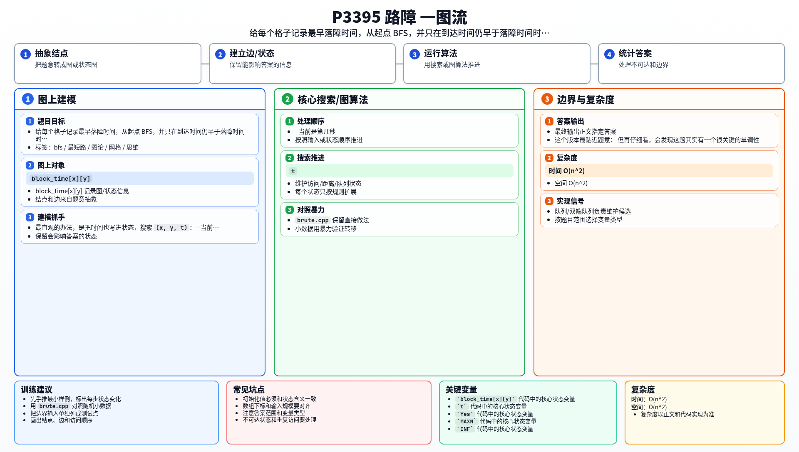

[[TOC]]

### 题意

有一个 `n × n` 的棋盘，B 君从 `(1,1)` 出发，要走到 `(n,n)`。

每秒他可以向上、下、左、右走一格。

同时，C 君会在每秒结束时往某个格子上放一个路障。放上之后，这个格子就不能再走了。

一组数据一共会给出 `2n-2` 次放路障的位置，要求判断 B 君是否还能成功到终点。

样例 1 可以这样理解：

| 时刻 | 棋盘状态 |
|---|---|
| 初始 | B 在 `(1,1)` |
| 第 1 秒后 | `(1,1)` 被封住，但 B 已经走开 |
| 第 2 秒后 | B 刚好走到 `(2,2)`，虽然这里随后也被封住，但路程已经完成 |

### 思路

最直观的办法，是把时间也写进状态，搜索 `(x, y, t)`：

- 当前人在什么位置；
- 当前是第几秒。

这个版本最贴近题意：

@include-code(./brute.cpp, cpp)

但再仔细看，会发现这题其实有一个很关键的单调性。

#### 越早到某个格子一定越好

因为路障只会越来越多，不会消失。

所以同一个格子：

- 如果你能更早到它，
- 那一定不比更晚到它差。

这意味着我们不需要在 BFS 里把“同一个格子在不同时间”都保留下来，只需要记住它第一次被到达的时间。

#### 给每个格子预处理落障时间

设 `block_time[x][y]` 表示这个格子最早会在第几秒结束时被封住。

- 没出现过的格子记成无穷大；
- 重复出现的格子，保留最早那一次。

现在如果我们准备在第 `t` 秒到达某个格子：

- 对普通格子，要求 `t < block_time[x][y]`；
- 对终点 `(n,n)`，题目样例说明它允许 `t == block_time[n][n]`。

也就是说，样例 1 中在第 2 秒走到终点，再在第 2 秒结束后落障，依然算成功。

#### 正式做法

1. 先把每个格子的最早落障时间预处理出来；
2. 从 `(1,1)` 做一次普通 BFS；
3. 扩展到相邻格子时，检查“该时刻是否还能进入这个格子”；
4. 只要 BFS 能走到 `(n,n)`，答案就是 `Yes`。

### 代码

@include-code(./main.cpp, cpp)

### 复杂度

- 时间复杂度：`O(n^2)`
- 空间复杂度：`O(n^2)`

### 总结

这题表面上看像动态障碍搜索，但真正关键的是抓住：

同一个格子只要更早到达，就一定更优。

有了这个单调性，时间维就不需要完整展开，只要保留每个格子的第一次到达时间，再结合落障时刻判断即可。

### 一图流解析

这张图把本题的建模、关键转移、实现检查和训练方法压缩到一页，适合读完正文后复盘。

