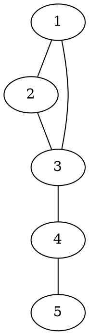

[[TOC]]

### 题意

有一张连通无向图，每个点代表一个城镇，每个城镇里正好有一个居民。

原本一共应该发生：

- `n * (n - 1)` 次访问

因为每个人都想访问其他所有人一次。

现在如果封锁某个城镇 `u`，就会导致：

- 任何和 `u` 有关的访问都不可能发生
- 删掉 `u` 以后，如果图被分成多个连通块，不同连通块之间的人也无法互相访问

题目要求对每个点 `u` 输出：

- 如果封锁 `u`，最终有多少次访问无法进行

#### 样例图

样例图长这样：

从图上就能看出：

- 点 `3` 和点 `4` 是关键位置
- 封锁 `3` 时，图会裂成 `{1,2}` 和 `{4,5}`
- 封锁 `4` 时，图会裂成 `{1,2,3}` 和 `{5}`

所以这两个点的答案会比普通点更大。

### 思路

先看一个最直接的暴力：

@include-code(./brute.cpp, cpp)

暴力做法是：

1. 枚举封锁哪个点 `u`
2. 真的把 `u` 删掉
3. 重新数删点后的每个连通块大小
4. 统计不同连通块之间一共有多少对访问作废

这个方法容易理解，但每个点都重跑一遍 DFS，复杂度太高。

正式做法的关键是把答案拆成两部分：

1. 所有和 `u` 直接有关的访问  
   这部分固定是 `2 * (n - 1)`  
   因为别人去 `u`、以及 `u` 去别人，这两类访问都作废。

2. 删掉 `u` 以后，不同连通块之间的访问  
   这部分只有当 `u` 是割点时才会额外出现。

所以问题就变成：

- 删掉点 `u` 后，会分出哪些连通块？它们大小是多少？

这正是 Tarjan 割点里 `low[v] >= dfn[u]` 的含义。

如果 `u` 有一个儿子 `v` 满足：

`low[v] >= dfn[u]`

说明删掉 `u` 以后，`v` 这棵子树会单独裂成一个连通块，大小就是 `sub_size[v]`。

于是我们在 DFS 回溯时，把每个这样的“被切下来的块”依次拿出来计数即可。

设这些块的大小依次是：

- `c1, c2, ..., ck`

那么它们和“前面已经切出来的点”之间会新增：

- `2 * c_i * (前面所有块大小之和)`

次作废访问。

最后还要补上一个“剩余大块”：

- 它的大小是 `n - 1 - (c1 + c2 + ... + ck)`

这块和前面所有被切下来的块之间，也会产生同样的双向损失。

所以整道题其实就是：

- Tarjan 求割点
- 同时维护每棵子树大小
- 在回溯时用这些大小直接算贡献

### 代码

@include-code(./main.cpp, cpp)

### 复杂度

每个点访问一次，每条边只会被常数次处理，所以：

- 时间复杂度 `O(n+m)`
- 空间复杂度 `O(n+m)`

### 总结

这题最重要的转化是：

- 不要直接去算“还能访问多少次”
- 而是去算“哪些访问作废了”

一旦改成“作废访问数”，就会自然拆成：

1. 和被封锁点本身有关的固定损失
2. 割点把图切开后，不同块之间的额外损失

于是 Tarjan 的 `low[v] >= dfn[u]` 不再只是“判割点”，而是直接告诉我们：

- 有一个大小为 `sub_size[v]` 的连通块被切下来了

这就是这题的核心。 
