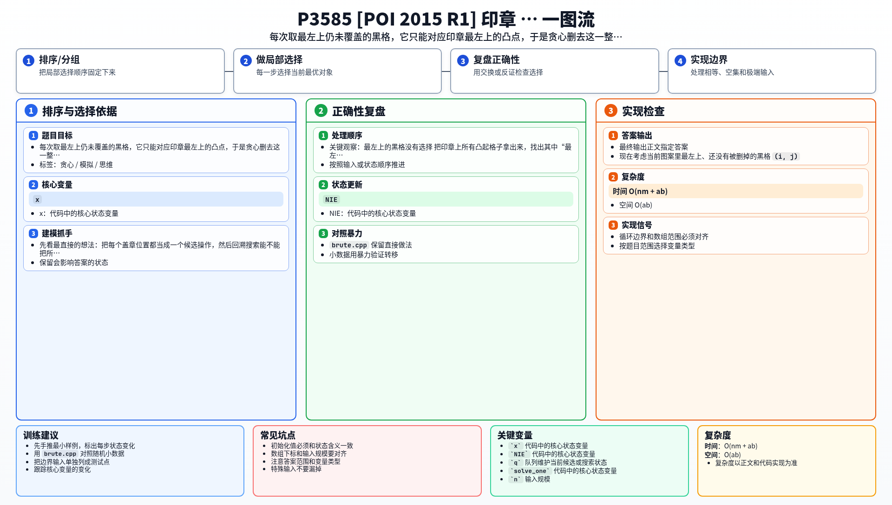

[[TOC]]

### 题意

给一张 `n × m` 的目标图案，其中 `x` 表示必须被印成黑色，`.` 表示必须保持白色。

再给一个 `a × b` 的印章，印章上 `x` 的位置表示凸起，会真正沾墨。

可以把印章平移后反复盖到纸上，但必须满足：

1. 不能旋转；
2. 不能盖出纸外；
3. 同一个格子不能被印两次。

问能否恰好印出目标图案。

### 思路

先看最直接的想法：把每个盖章位置都当成一个候选操作，然后回溯搜索能不能把所有黑格恰好覆盖一次：

@include-code(./brute.cpp, cpp)

这个做法只适合很小数据，但它能帮助我们发现一个很强的“强制性”。

#### 关键观察：最左上的黑格没有选择

把印章上所有凸起格子拿出来，找出其中“最左上”的那个凸点，记为锚点。

现在考虑当前图案里最左上、还没有被删掉的黑格 `(i, j)`。

它在任何合法方案里，都只能对应某次盖章中的这个锚点。原因是：

- 如果它对应的是印章里的其他凸点，那么那次盖章的锚点一定会落在一个更靠上或更靠左的位置；
- 由于锚点本身也是凸起，会印出一个更早出现的黑格；
- 这就和 `(i, j)` 是当前最左上的黑格矛盾。

所以，当前最左上的黑格一旦确定，这次盖章的位置也就被唯一确定了。

#### 贪心删除

于是我们可以直接贪心：

1. 扫描整张图，找到当前最左上的黑格；
2. 把印章锚点对准它；
3. 检查这次盖章的所有凸起位置：
   - 都必须落在纸内；
   - 都必须正好对应当前还没删掉的黑格；
4. 如果有任何一个位置不满足，答案就是 `NIE`；
5. 否则把这次盖章覆盖到的黑格全部删掉，继续处理。

因为每次删掉的是一整次真实盖章，所以不会重复覆盖；而最左上的黑格又是被强制决定的，所以这个过程不会错过合法方案。

总工作量也很小：印章的每个凸点只会在真正删除某次盖章时被访问一次，总体就是线性级别。

### 代码

@include-code(./main.cpp, cpp)

### 复杂度

- 时间复杂度：`O(nm + ab)`
- 空间复杂度：`O(ab)`

### 总结

这题表面像 exact cover，但因为“不允许重复覆盖”，最左上的黑格其实会强制决定下一次盖章位置。

抓住这个唯一性以后，整题就从回溯搜索变成了顺序贪心删除。

### 一图流解析

这张图把本题的建模、关键转移、实现检查和训练方法压缩到一页，适合读完正文后复盘。

