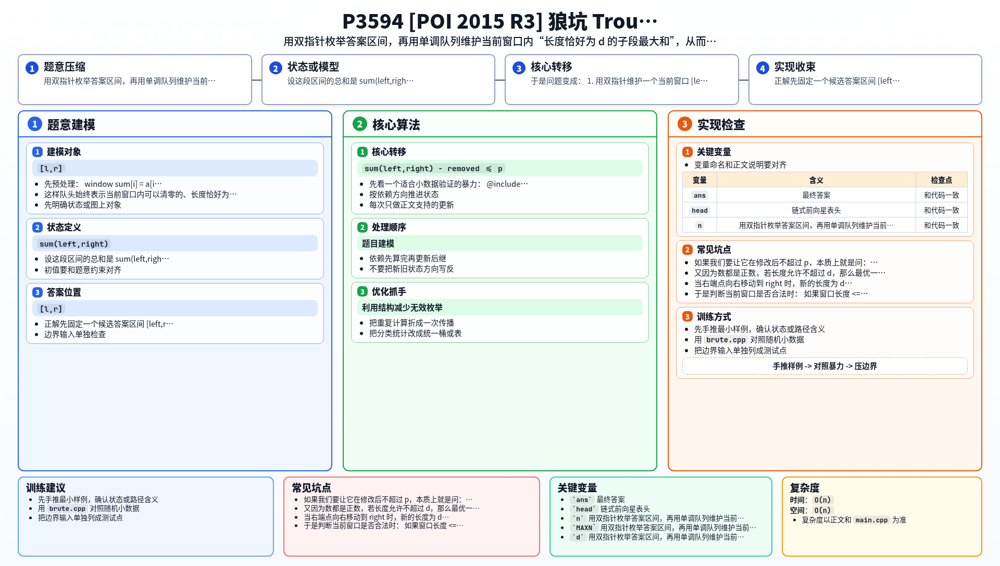

[[TOC]]

### 题意

给定一个长度为 `n` 的正整数序列。

你可以选择至多一次，把某一段连续长度不超过 `d` 的区间全部改成 `0`。

要求找到最长的连续区间，使得在进行这次修改后，该区间内所有数的和不超过 `p`。

### 思路

先看一个适合小数据验证的暴力：

@include-code(./brute.cpp, cpp)

暴力会枚举答案区间 `[l,r]`，然后再枚举这段区间里要清零的那一小段，求出能减掉的最大和。

显然这样太慢。

正解先固定一个候选答案区间 `[left,right]`。

设这段区间的总和是 `sum(left,right)`。

如果我们要让它在修改后不超过 `p`，本质上就是问：

在 `[left,right]` 里面，能不能找到一段长度不超过 `d` 的子区间，把它清零后使得：

`sum(left,right) - removed <= p`

因为所有数都为正数，所以在固定 `[left,right]` 的情况下，当然应该把“能清零的那一段”选成和最大的那一段。

又因为数都是正数，若长度允许不超过 `d`，那么最优一定会取到长度恰好为 `d`；
如果整个区间长度本来就不超过 `d`，那直接把整段清零即可。

于是问题变成：

1. 用双指针维护一个当前窗口 `[left,right]`
2. 维护窗口总和 `cur_sum`
3. 维护窗口内所有“长度恰好为 `d` 的子段和”的最大值

第三步可以用单调队列。

先预处理：

`window_sum[i] = a[i] + a[i+1] + ... + a[i+d-1]`

表示起点是 `i`、长度恰好为 `d` 的子段和。

当右端点向右移动到 `right` 时，新的长度为 `d` 的子段起点就是：

`start = right-d+1`

如果 `start >= 1`，就把 `window_sum[start]` 加入单调队列。

当左端点右移时，所有起点 `< left` 的长度为 `d` 子段都已经不完全落在当前窗口里了，需要从队头弹掉。

这样队头始终表示当前窗口内可以清零的、长度恰好为 `d` 的子段最大和。

于是判断当前窗口是否合法时：

- 如果窗口长度 `<= d`，可以整段清零，一定合法
- 否则看 `cur_sum - max_d_segment <= p` 是否成立

若不合法，就不断右移左端点。

整个过程就是标准的双指针，每个下标和每个 `window_sum` 候选都只会进出队一次，总复杂度线性。

### 代码

@include-code(./main.cpp, cpp)

### 复杂度

时间复杂度 `O(n)`，空间复杂度 `O(n)`。

### 总结

这题的关键是把“允许清零一段”转成“当前窗口里减去一个最大子段和”。

一旦看出这个最大子段和只需要维护长度恰好为 `d` 的连续段，并且随着双指针窗口移动，就可以自然地用单调队列完成维护。

### 一图流解析

这张图把本题的建模、关键转移、实现检查和训练方法压缩到一页，适合读完正文后复盘。

