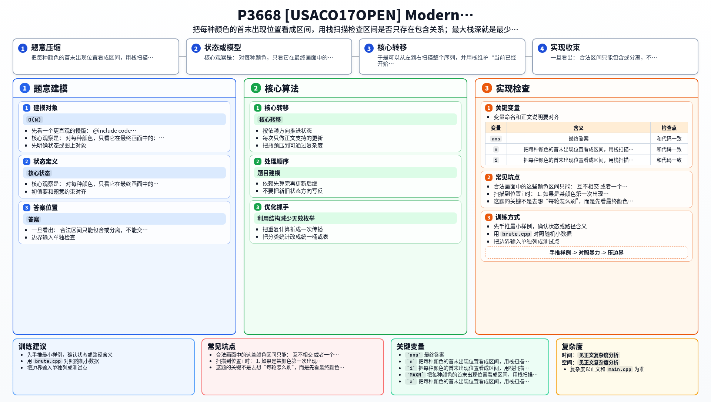

[[TOC]]

### 题意

给一个长度为 `N` 的最终颜色序列，`0` 表示空白。

原作者画画时，每种颜色只会刷一次，而且一次刷的是一个连续区间。

复制者要分若干轮来完成复制：

- 每轮可以刷若干个互不相交区间
- 每种颜色整个过程中也只能刷一次

要求最少需要多少轮；如果根本画不出来，输出 `-1`。

### 思路

先看一个更直观的慢版：

@include-code(./brute.cpp, cpp)

`brute.cpp` 直接按定义检查：

- 任意两种颜色区间是否交叉
- 每个位置真正露在最上层的颜色是不是当前颜色
- 最大覆盖层数是多少

这个版本适合帮助理解题意，但正式解可以做到线性。

核心观察是：

对每种颜色，只看它在最终画面中的：

- 第一次出现位置
- 最后一次出现位置

就能把它看成一个区间。

合法画面中的这些颜色区间只能：

- 互不相交
- 或者一个完全包含另一个

如果出现：

```text
l1 < l2 < r1 < r2
```

这样的交叉关系，就说明某种颜色会被切成两段，而它又只能刷一次连续区间，所以必定无解。

于是可以从左到右扫描整个序列，并用栈维护“当前已经开始但还没结束”的颜色区间。

扫描到位置 `i` 时：

1. 如果是某颜色第一次出现，就把它入栈
2. 当前颜色必须等于栈顶颜色，否则无解
3. 如果是某颜色最后一次出现，就把它出栈

还要特别注意 `0`：

- 如果当前位置是 `0`，但栈还不空
- 说明某个颜色区间内部出现了空白
- 这同样无解

栈深度的最大值，就是同一时刻叠在一起的颜色层数，也就是复制者最少需要的轮数。

### 代码

@include-code(./main.cpp, cpp)

### 复杂度

每种颜色最多入栈一次、出栈一次，整段扫描只做线性处理。

所以时间复杂度是：

`O(N)`

空间复杂度是：

`O(N)`

### 总结

这题的关键不是去想“每轮怎么刷”，而是先看最终颜色区间之间必须满足什么结构。

一旦看出：

- 合法区间只能包含或分离，不能交叉
- 扫描时最上层颜色就是当前打开区间里的最内层颜色

就能自然得到栈解法。


### 一图流解析

这张图把本题的建模、关键转移、实现检查和训练方法压缩到一页，适合读完正文后复盘。


