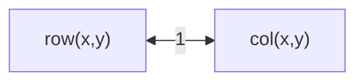
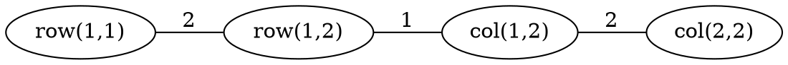

[[TOC]]

### 题意

有一个 `n × n` 的地铁网格，每个交点都是一个站。

- 走过相邻两个站，花 `2` 分钟
- 只有给出的 `m` 个换乘站，才能在站内从横线换到竖线，花 `1` 分钟

从学校 `(sx, sy)` 回家 `(tx, ty)`，问最少需要多少时间。  
如果根本到不了，就输出 `-1`。

### 思路

先看一个最直接的小数据暴力：

@include-code(./brute.cpp, cpp)

`brute.cpp` 直接在整个 `n × n` 网格上建状态图：

1. 每个站拆成两个状态：
   - 正在坐横线
   - 正在坐竖线
2. 横线状态只能在同一行左右走
3. 竖线状态只能在同一列上下走
4. 如果这个站是换乘站，就在两个状态之间连一条权值 `1` 的边

这个做法最贴题意，但点数会膨胀到 `2n^2`。  
本题 `n` 最大有 `20000`，显然不可能这样直接建。

关键观察是：

- 真正有决策意义的点，只有：
  - 换乘站
  - 起点
  - 终点

因为在同一条横线或竖线上，如果中间一长串站都不能换乘，那么人只会“直着坐过去”，中间那些站不会产生新的选择。

所以我们只需要保留这些关键点。

#### 1. 状态拆点

对于每个关键点 `(x,y)`，拆成两个点：

- `row(x,y)`：表示你现在坐在横线里
- `col(x,y)`：表示你现在坐在竖线里

如果这个关键点本身是换乘站，那么：

- `row(x,y) <-> col(x,y)` 连一条权值 `1` 的边

这张图表示的就是这个拆点动作：

这条边只在“能换乘”的站存在。  
起点和终点就算和某个换乘站重合，我们也不额外发明规则，照样放进图里处理。

#### 2. 同线只连相邻关键点

现在考虑同一行上的若干关键点。  
如果它们按列坐标排好序是：

`p1, p2, p3, ...`

那么在横线状态里，只需要连：

- `p1 <-> p2`
- `p2 <-> p3`
- ...

边权就是站数差乘 `2`。

原因很简单：  
在同一条线里直着坐，路费满足三角形关系。  
如果你想从更左边去更右边，经过中间关键点拆成若干段，总代价和直接按站数计算是一样的。  
所以只保留相邻关键点，就不会丢失最短路。

同一列完全同理。

#### 样例结构图

这张图展示“关键点拆状态 + 同线相邻连边”的结构：

它对应的正是：

1. 先沿横线坐一站
2. 在换乘站切到竖线
3. 再沿竖线坐一站

这和题面的真实过程是一一对应的。

#### 3. 起点和终点怎么处理

出发时你就在学校站里，所以：

- 可以直接选择先坐横线
- 也可以直接选择先坐竖线

都不需要额外换乘时间。  
因此 Dijkstra 初始化时，把起点的两个状态距离都设成 `0` 即可。

终点同理，只要到达：

- `row(tx,ty)` 或 `col(tx,ty)`

任意一个状态，都算到家了。

### 代码

@include-code(./main.cpp, cpp)

### 复杂度

设关键点总数是：

- `m + 2`

排序两次：

- `O(m log m)`

建图后的边数是线性的，因为每条横线、竖线只连相邻关键点。  
最后跑一次 Dijkstra：

- `O(m log m)`

总复杂度：

- `O(m log m)`

空间复杂度：

- `O(m)`

### 总结

这题最关键的不是最短路模板，而是先把大网格压缩掉。

真正有用的想法只有两步：

1. 只保留“会产生选择”的关键点
2. 每个关键点拆成横线状态和竖线状态

一旦建图想清楚，后面就是一题标准的最短路。
