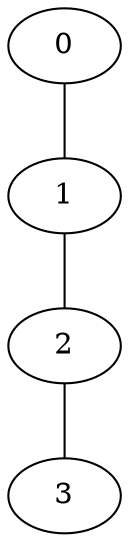

[[TOC]]

### 题意

给一棵根为 `0` 的树，初始时每个点的果子数都是 `0`。

有两类操作：

1. `A u v d`  
   把路径 `u -> v` 上所有节点的果子数都加上 `d`

2. `Q u`  
   询问当前以 `u` 为根的整棵子树里，一共有多少个果子

#### 样例树

样例树是一条链：

执行一次 `A 1 3 1` 后：

- 点 `1, 2, 3` 各加 `1`

所以：

- 子树 `0` 的和是 `3`
- 子树 `1` 的和是 `3`
- 子树 `2` 的和是 `2`

### 思路

先看一个最直接的小数据暴力：

@include-code(./brute.cpp, cpp)

暴力做法就是：

1. 真正把路径 `u -> v` 上的每个点都加上 `d`
2. 查询时再暴力把子树里的点全部加起来

这个做法最贴近题意，但显然扛不住大数据。

这题的关键不是树剖本身，而是先把“路径加”换成“树上差分”。

对于一次路径加 `u, v, d`，设 `p = lca(u, v)`，做：

- `diff[u] += d`
- `diff[v] += d`
- `diff[p] -= d`
- `diff[parent(p)] -= d`（如果 `p` 不是根）

这样做完以后，某个点 `x` 当前真正的果子数，等于：

- `diff` 在 `x` 子树里的总和

也就是：

- `value[x] = sum(diff[y]), y 在 subtree(x)`

现在题目要求的是：

- `subtree(u)` 里所有 `value[x]` 的总和

把这个式子再展开一层：

`sum_{x in subtree(u)} value[x]`

等于

`sum_{y in subtree(u)} diff[y] * (depth[y] - depth[u] + 1)`

原因是：

- 一个点 `y` 的差分值，会贡献给它在 `subtree(u)` 里的所有祖先
- 这样的祖先数量正好是 `depth[y] - depth[u] + 1`

于是查询可以改写成：

`sum(diff * (depth+1)) - depth[u] * sum(diff)`

这就很适合用 DFS 序来维护：

1. 子树在 DFS 序上是连续区间
2. 用一棵树状数组维护 `diff`
3. 再用另一棵树状数组维护 `diff * (depth+1)`

路径加时只做 4 次单点修改。  
查询子树和时，只要在 `[tin[u], tout[u]]` 上查这两个区间和，再套公式即可。

### 代码

@include-code(./main.cpp, cpp)

### 复杂度

预处理：

- DFS 序和倍增 LCA：`O(n log n)`

每次操作：

- 路径加：1 次 LCA + 4 次树状数组单点修改，`O(log n)`
- 子树查询：2 次树状数组区间求和，`O(log n)`

空间复杂度：

- `O(n log n)`

### 总结

这题最值得记住的不是“树状数组”本身，而是这一步转化：

- 路径加先做树上差分
- 子树和再把 `value[x]` 展开成 `diff` 的加权和

一旦写成：

`sum(diff * (depth+1)) - depth[u] * sum(diff)`

整题就从“树上路径更新 + 子树查询”变成了：

- `LCA`
- `DFS 序`
- `两棵树状数组`

的经典组合。
