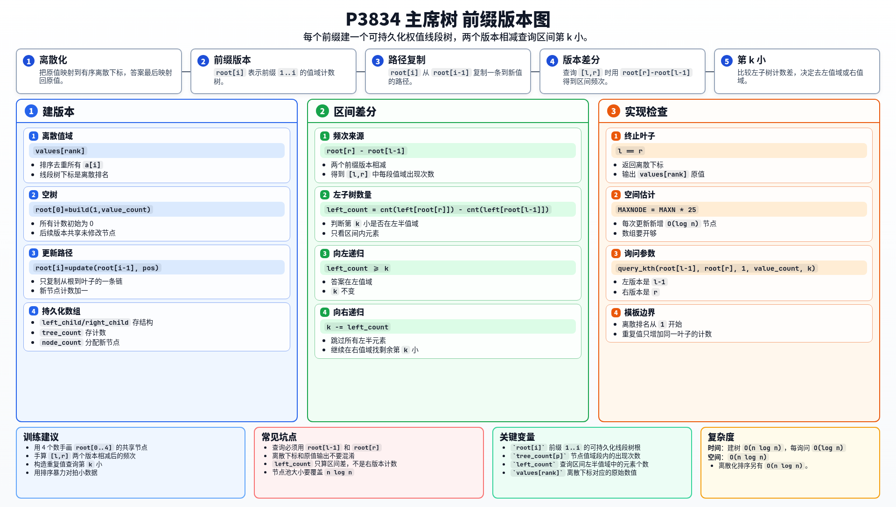

[[TOC]]

### 题意

给定一个静态数组，多次询问区间 `[l,r]` 内第 `k` 小的数。

### 思路

朴素做法是每次复制 `[l,r]`，排序后输出第 `k` 个。

先看一个可以直接验证想法的朴素解：

@include-code(./brute.cpp, cpp)

朴素做法无法承受 `2 * 10^5` 级别的数据。因为数组没有修改，可以考虑维护前缀信息。

先把所有数离散化。对每个前缀 `1..i` 建一棵权值线段树 `root[i]`，表示每个离散值在这个前缀中出现了多少次。相邻前缀只多一个数，所以 `root[i]` 可以从 `root[i-1]` 复制一条路径得到，其余节点共享。

对于询问 `[l,r]`，区间内的频次等于：

```text
root[r] - root[l-1]
```

查询第 `k` 小时，看左子树中有多少个区间元素：

```text
left_count = count(left_child[root[r]]) - count(left_child[root[l-1]])
```

如果 `left_count >= k`，答案在左值域；否则答案在右值域，并把 `k` 减去 `left_count`。递归到叶子后，将离散下标映射回原值即可。

### 代码

@include-code(./main.cpp, cpp)

### 复杂度

离散化和建树总时间 `O(n log n)`，每次查询 `O(log n)`。

空间复杂度 `O(n log n)`。

### 总结

主席树解决静态区间第 `k` 小的关键是“前缀版本差分”。两个版本相减后，就得到区间内每个值域段的出现次数。

### 一图流解析

这张图把本题的建模、关键转移、实现检查和训练方法压缩到一页，适合读完正文后复盘。


