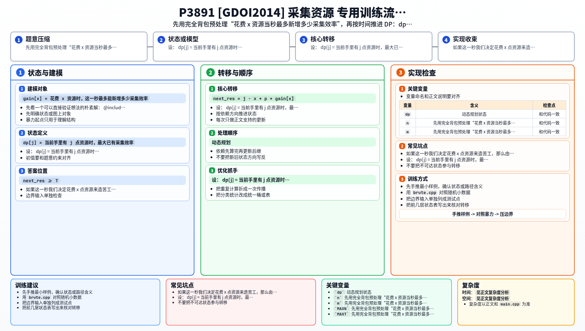

[[TOC]]

### 题意

开始时你有 `M` 点资源，目标是在最短时间内让资源数量达到至少 `T`。

有 `N` 种苦工可以无限建造。  
第 `i` 种苦工：

- 建造花费 `A_i` 点资源
- 建成后每秒能采集 `B_i` 点资源

一秒内的流程是：

1. 先用当前手头资源建造任意多个苦工
2. 这些新苦工会立刻在这一秒参与采集
3. 这一秒结束时获得所有已有苦工的总采集量

求最少多少秒能使资源达到至少 `T`。

### 思路

先看一个可以直接验证想法的朴素解：

@include-code(./brute.cpp, cpp)

这题最关键的是把“一秒里建哪些苦工”先单独抽出来看。

如果这一秒我们决定花费 `x` 点资源来造苦工，那么由于每种苦工都可以造任意多个，这其实就是一个完全背包：

`gain[x] = 花费 x 资源时，这一秒最多能新增多少采集效率`

这个 `gain[x]` 和具体是哪一天无关，可以先一次性预处理出来。

然后再做按时间推进的 DP。

设：

`dp[j] = 当前手里有 j 点资源时，最大已有采集效率`

如果当前资源是 `j`，已有采集效率是 `p`，这一秒决定花费 `x` 资源建造苦工，那么：

- 新增采集效率：`gain[x]`
- 下一秒开始前的总采集效率：`p + gain[x]`
- 这一秒结束后的资源数：`j - x + p + gain[x]`

于是就有转移：

`next_res = j - x + p + gain[x]`

`next_prod = p + gain[x]`

只要 `next_res >= T`，当前秒数加一就是答案。

为什么 `dp[j]` 只保留“最大采集效率”就够了？  
因为在同样资源 `j` 下，采集效率越大，之后每一秒得到的资源只会更多，不会更差。

### 代码

@include-code(./main.cpp, cpp)

### 复杂度

设目标资源是 `T`。

- 预处理完全背包复杂度 `O(NT)`
- 按天推进的 DP 复杂度最坏 `O(T^3)`

但这里 `T <= 1000`，而且一旦到达答案就立刻退出，可以通过。

### 总结

这题有两层决策：

1. 一秒内怎么花资源造苦工
2. 过了若干秒以后，资源和采集效率会变成什么

第一层可以先用完全背包压成 `gain[x]`，第二层再做时间 DP，整个模型就顺了。

### 一图流解析

这张图把本题的建模、关键转移、实现检查和训练方法压缩到一页，适合读完正文后复盘。

