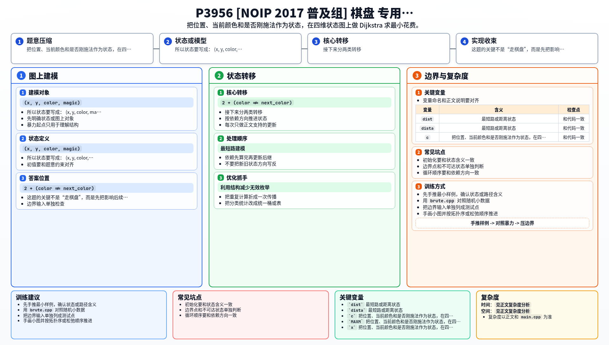

[[TOC]]

### 题意

给一个 `m x m` 棋盘，部分格子本来就有颜色，部分格子无色。

你要从 `(1,1)` 走到 `(m,m)`，每次只能上下左右移动。

如果走向本来就有颜色的格子：

- 同色花费 `0`
- 异色花费 `1`

如果走向无色格子：

- 必须先施法把它临时染色，花费 `2`
- 并且魔法不能连续使用

求最少花费，无法到达输出 `-1`。

### 思路

先看一个可以直接验证想法的朴素解：

@include-code(./brute.cpp, cpp)

这题表面上像网格最短路，但一个格子不能只看坐标。

因为到达同一个格子时，后续决策还取决于两件事：

1. 当前脚下格子的颜色是什么；
2. 当前脚下格子是不是刚用魔法临时染出来的。

所以状态要写成：

- `(x, y, color, magic)`

其中：

- `color` 表示当前所在格的颜色；
- `magic = 1` 表示当前格子是临时染色格；
- `magic = 0` 表示当前格子本来就有颜色。

接下来分两类转移。

第一类，下一格本来就有颜色。

设下一格颜色是 `next_color`，那么：

- `color == next_color`，花费加 `0`
- `color != next_color`，花费加 `1`

并且走过去后 `magic` 一定变成 `0`。

第二类，下一格是无色格。

这时只有当前 `magic == 0` 才允许施法。
你可以把下一格染成红色或黄色中的任意一种：

- 施法固定花费 `2`
- 若染出来的颜色和当前颜色不同，再额外花 `1`

所以总代价是：

- `2 + (color != next_color)`

走过去后，新的状态 `magic = 1`。

所有边权都非负，因此直接在这张状态图上跑 Dijkstra 即可。

### 代码

@include-code(./main.cpp, cpp)

### 复杂度

状态数是 `m^2 * 2 * 2`，
每个状态最多向四个方向转移一次，
所以总时间复杂度是 `O(m^2 log m^2)`，空间复杂度是 `O(m^2)`。

### 总结

这题的关键不是“走棋盘”，而是先把影响后续决策的信息补全成状态：

- 当前位置
- 当前颜色
- 是否刚施法

只要这三个因素记全，它就是一题标准的状态最短路。

### 一图流解析

这张图把本题的建模、关键转移、实现检查和训练方法压缩到一页，适合读完正文后复盘。

