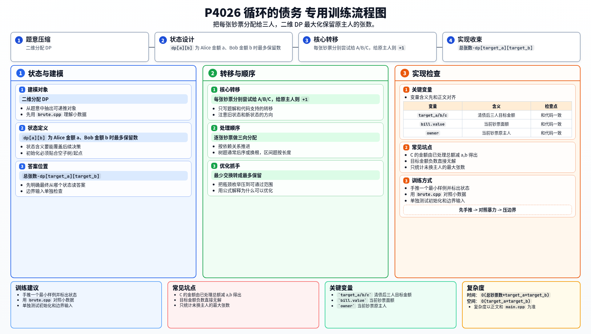

[[TOC]]

### 题意

三个人互相之间有循环债务，同时每个人手里有一些不同面额的钞票。

现在要通过重新分配这些钞票来清偿债务，要求每个人最终持有的钱数恰好等于清债后的目标金额。

代价是“发生交换的钞票张数”。  
求最少需要交换多少张钞票；如果无解，输出 `impossible`。

### 思路

先看一个可以直接验证想法的朴素解：

@include-code(./brute.cpp, cpp)

这题最适合的视角不是“钱怎么传”，而是：

> 每张钞票最后归谁？

如果一张钞票最后还留在原主人手里，那么它就没有被交换。  
所以目标就变成：

> 在满足三个人最终金额要求的前提下，尽量让更多钞票留在原主人手里。

设三个人最终应该持有的钱分别是：

- `target_a`
- `target_b`
- `target_c`

这三个值可以从输入债务直接算出来。

接着把每张钞票看成一个独立物品。  
做一个二维 DP：

`dp[a][b] = 当前已经处理完若干张钞票，最终分给 Alice 金额为 a、分给 Bob 金额为 b 时，最多有多少张钞票没换主人`

那么分给 Cynthia 的金额就由“已处理总金额 - a - b”唯一确定。

处理一张钞票时有三种选择：最终给 Alice、Bob 或 Cynthia。  
如果给的人正好是原主人，那么“保留原主人不变的张数”就加一。

最终如果 `dp[target_a][target_b]` 可达，那么：

`最少交换张数 = 总张数 - 最多保留张数`

#### DP 转移方程

核心状态：

`dp[a][b]` 为 Alice 金额 a、Bob 金额 b 时最多保留数

核心转移：

每张钞票分别尝试给 A/B/C，给原主人则 `+1`

答案收束：

`总张数-dp[target_a][target_b]`

### 代码

@include-code(./main.cpp, cpp)

### 复杂度

设总金额不超过 `S`，这里 `S <= 1000`。

DP 状态数是 `O(target_a * target_b)`，总复杂度约为：

`O(总钞票数 * target_a * target_b)`

在本题数据范围内可以通过。

### 总结

这题的关键是把“最少交换张数”转成“最多保留多少张原主人不变的钞票”。

一旦换这个角度，题目就变成非常标准的逐张物品分配 DP。

### 一图流解析

这张图把本题的建模、关键转移、实现检查和训练方法压缩到一页，适合读完正文后复盘。

