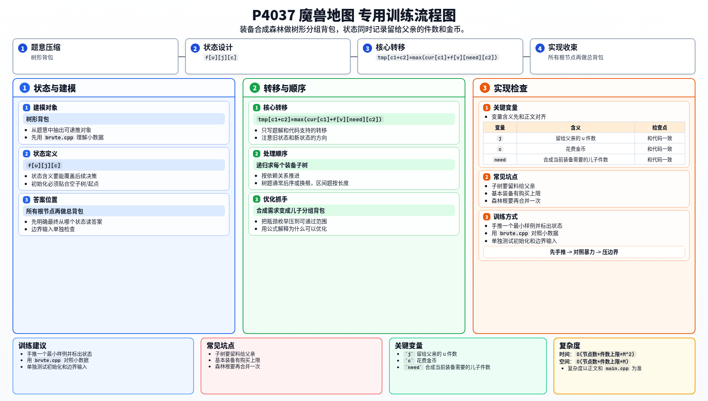

[[TOC]]

### 题意

有两类装备：

- 基本装备：可以直接花金币购买，且有数量限制
- 高级装备：由若干低级装备合成，合成不额外花金币

每件装备都有固定的力量值。  
英雄有 `M` 金币，目标是在预算内让总力量值尽量大。

题目保证装备的合成关系是一片森林。

### 思路

先看一个可以直接验证想法的小数据版本：

@include-code(./brute.cpp, cpp)

这题的关键在于：

一个子树不仅会给自己贡献力量值，还可能要“留出若干件当前装备”给父亲继续合成。

所以设：

`f[u][j][c]`

表示在 `u` 这棵子树里：

- 留出 `j` 件 `u` 给父亲继续合成
- 花费 `c` 金币
- 能得到的最大力量值

#### DP 转移方程

基本装备的状态来自“买 `t` 件，留 `j` 件”：

$$
f[u][j][cost] = (t-j)\cdot value[u]
$$

高级装备先枚举合成 `i` 件，再把每个儿子的需求做分组背包合并。
如果儿子 `v` 需要提供 `need` 件，则合并金币维度时本质是：

$$
tmp[c_1+c_2]=\max(tmp[c_1+c_2],\ cur[c_1]+f[v][need][c_2])
$$

合成出的 `i` 件中留下 `j` 件给父亲，剩余 `i-j` 件计入当前装备价值。

对于基本装备很好理解：

- 如果总共买了 `t` 件
- 其中 `j` 件留给父亲
- 那么剩下 `t-j` 件可以直接贡献力量值

对于高级装备：

1. 先假设总共要合成 `i` 件当前装备
2. 那么每个儿子都必须提供固定数量的子装备
3. 儿子之间做一次分组背包，求出满足这些原料需求时的最优力量值
4. 再枚举其中有多少件 `j` 要留给父亲，剩下 `i-j` 件自己计入力量值

最后因为整张图可能是一片森林，再把所有根节点做一次总背包合并即可。

### 代码

@include-code(./main.cpp, cpp)

### 复杂度

设金币上限为 `M`。

这份做法的复杂度大致是树形分组背包级别，核心复杂度约为 `O(节点数 * 件数上限 * M^2)`。

在本题给定的官方范围下，这也是目前常见题解采用的主流模型。

### 总结

这题最容易漏掉的一点是：

> 子树不是只回答“我自己能做多少价值”，还要回答“我还能向父亲提供多少件当前装备”。

把这一维状态补进去之后，整道题就变成标准的树形背包。

### 一图流解析

这张图把本题的建模、关键转移、实现检查和训练方法压缩到一页，适合读完正文后复盘。

