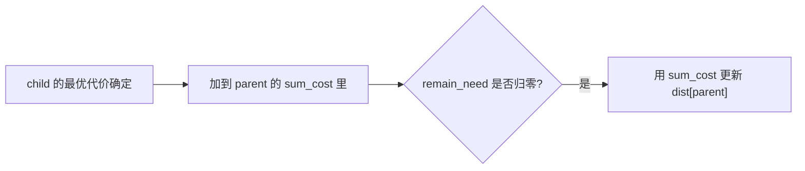

[[TOC]]

### 题意

面对一种怪兽 `i` 时，有两种处理方式：

1. 法术攻击：花 `K_i`，直接彻底消灭
2. 普通攻击：花 `S_i`，但它会变出若干只新的怪兽

这些新怪兽也必须继续被清理。  
现在只有一只 `1` 号怪兽出现，问最少要花多少体力才能把它和它衍生出来的所有怪兽全部消灭。

### 思路

先看一个更直观的小数据暴力：

@include-code(./brute.cpp, cpp)

暴力其实就是把题意直接写成方程：

- `f[i]` 表示杀死一只 `i` 号怪兽的最小体力

那么：

- 如果用法术攻击，代价是 `K_i`
- 如果用普通攻击，代价是 `S_i + 生成出来的所有怪兽代价之和`

所以有：

`f[i] = min(K_i, S_i + sum(f[child]))`

`brute.cpp` 就是反复用这个式子去松弛，直到所有值都不再下降。

这个写法很好理解，但大数据下反复全扫会太慢。

#### 关键观察

把式子换个方向看：

- 子怪兽的代价确定之后，父怪兽用普通攻击的总代价也就确定了

也就是说，信息传播方向其实是：

- 从“被生成的怪兽”反向流回“生成它的怪兽”

#### 初始化为什么可以从法术攻击开始

对每种怪兽来说，法术攻击永远是一种合法方案。  
所以一开始我们就知道一个上界：

- `f[i] <= K_i`

于是可以先把：

- `f[i] = K_i`

当成初值。

如果后来发现：

- `S_i + sum(f[child])`

更小，就再把 `f[i]` 往下更新。

#### 为什么像 Dijkstra 一样做

普通攻击方案的总代价是：

- `S_i + sum(f[child])`

注意这里 `S_i > 0`，而且每个 child 的代价也都是非负。  
所以一个怪兽通过普通攻击得到的总代价，一定不会比它那些子怪兽的代价更小。

这说明“更小的答案”会先在子怪兽处出现，再逐步传回父怪兽。  
因此可以像 Dijkstra 那样：

1. 先确定当前代价最小的怪兽
2. 用它去反向更新所有父怪兽

#### 维护什么量

对每个怪兽 `i`，维护：

- `dist[i]`：当前最优答案
- `sum_cost[i]`：如果走普通攻击，目前已经累计出的总代价
- `remain_need[i]`：这个普通攻击方案里，还有多少个子怪兽的最终代价没确认

当某个子怪兽 `u` 的最终代价确定后，就把它加进所有父怪兽的 `sum_cost`。  
如果某个父怪兽的所有子怪兽都处理完了，那么它的普通攻击方案总代价也就完整了，可以拿来更新答案。

这个过程可以用下面这张图来理解：

图里真正要看的，不是道路或最短路边，而是“一个普通攻击方案何时才算完整可用”。  
只有它生成出来的所有怪兽代价都已经确定，这个方案才能真正参与比较。

### 代码

@include-code(./main.cpp, cpp)

### 复杂度

设所有普通攻击生成关系的总数是：

- `R = sum R_i`

每个生成关系只会被处理一次，优先队列复杂度为：

- `O((N + R) log N)`

空间复杂度：

- `O(N + R)`

### 总结

这题表面不像最短路，但本质上很像一类“反向更新”的最优值传播。

最关键的式子只有一个：

- `f[i] = min(K_i, S_i + sum(f[child]))`

一旦把它想清楚，再意识到信息是从子怪兽往父怪兽传，就能顺着写出整题。
