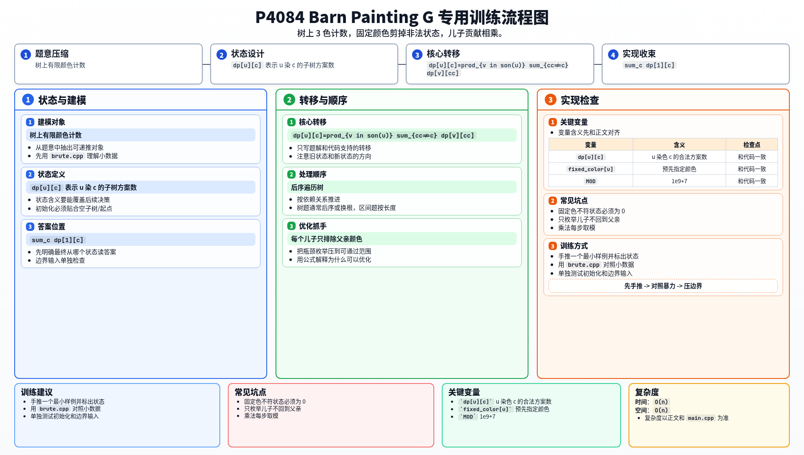

[[TOC]]

### 题意

给一棵树，要用 3 种颜色给所有点染色。

要求：

- 每条边两端颜色不同
- 部分点已经预先指定颜色

求合法染色方案数，对 `1e9+7` 取模。

### 思路

先看一个可以直接验证想法的朴素解：

@include-code(./brute.cpp, cpp)

`brute.cpp` 直接枚举每个点的颜色，再检查是否满足相邻点不同色和预染色限制。
这个方法完全正确，但复杂度是 `3^n`，只能做小数据。

这题是很标准的树形 DP 计数。

设 `dp[u][c]` 表示：

- `u` 染成颜色 `c`
- 且整棵 `u` 子树合法染色
- 的方案数

#### DP 转移方程

若 `u` 没有被固定成其它颜色，则：

$$
dp[u][c]=\prod_{v \in son(u)} \sum_{cc \ne c} dp[v][cc]
$$

若 `u` 已经被固定颜色 `fixed[u]`，则所有 `c != fixed[u]` 的状态为 `0`。
最终答案为：

$$
dp[1][1]+dp[1][2]+dp[1][3]
$$

如果 `u` 已经被固定成别的颜色，那么这个状态直接为 `0`。

否则，对每个儿子 `v`：

- `v` 的颜色只能从另外两种里选

所以这个儿子的贡献就是：

`dp[v][1] + dp[v][2] + dp[v][3]` 中去掉和 `c` 相同的那一项

再把所有儿子的贡献乘起来，就是 `dp[u][c]`。

由于不同儿子子树之间互不影响，这个乘法是成立的。

最后答案就是：

`dp[1][1] + dp[1][2] + dp[1][3]`

### 代码

@include-code(./main.cpp, cpp)

### 复杂度

每个点只会被处理一次，每次只枚举 3 种颜色和它的所有儿子。

所以时间复杂度是 `O(n)`，空间复杂度是 `O(n)`。

### 总结

这题的核心状态非常经典：

- `dp[u][颜色]`

而转移本质就是：

- 当前点定色后
- 儿子只能从剩下两种颜色里选

是树上有限颜色计数 DP 的标准模板。

### 一图流解析

这张图把本题的建模、关键转移、实现检查和训练方法压缩到一页，适合读完正文后复盘。

