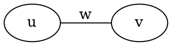
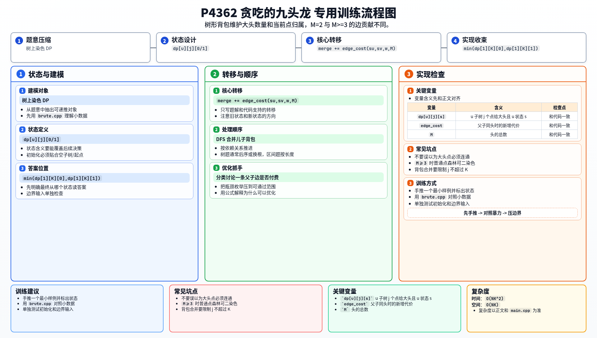

[[TOC]]

### 题意

把树上的 `N` 个果子分给 `M` 个头，每个头至少分到一个果子。

其中大头必须吃到恰好 `K` 个果子，并包含那一个“最大的果子”。

如果一条边两端的果子分给同一个头，这条边也会被一起吃掉，要付出这条边的难受值；如果两端分给不同的头，这条边会被砍断，代价为 `0`。

要求最小化总难受值。

### 思路

先看一个可以直接验证题意的暴力：

@include-code(./brute.cpp, cpp)

`brute.cpp` 直接枚举每个点分给哪个头，然后按照题意计算代价。
它只能处理很小的数据，但很适合对拍。

真正的关键是看清 `M=2` 和 `M>=3` 的区别。

当 `M=2` 时，只有“大头 / 普通头”两种颜色。
所以一条边只要两端分给同一个头，就一定要付这条边的边权。

当 `M>=3` 时，普通头至少还有两种颜色可用。
而“不属于大头”的那些点组成的是森林，一定可以二染色。
于是普通点之间的边总能安排成两端属于不同普通头，代价为 `0`。
这时只有“两端都给大头”的边才必须计入答案。

所以做树形 DP：

- `dp[u][j][0]`：`u` 子树里有 `j` 个点给大头，且 `u` 不给大头的最小代价
- `dp[u][j][1]`：`u` 子树里有 `j` 个点给大头，且 `u` 给大头的最小代价

合并儿子 `v` 时，只需要根据：

- `u` 是否给大头
- `v` 是否给大头
- 当前是 `M=2` 还是 `M>=3`

来决定边 `u-v` 是否要把边权加进去。

下面这张图展示“同头付代价、异头不付代价”的规则：

如果两个端点最终被分给同一个头，这条边就会被一起吃掉。
树形 DP 合并子树时，新增加的跨子树边只有父子这一条，所以状态转移可以写得很干净。

#### DP 转移方程

核心状态：

`dp[u][j][0/1]`

核心转移：

`merge += edge_cost(su,sv,w,M)`

答案收束：

`min(dp[1][K][0],dp[1][K][1])`

### 代码

@include-code(./main.cpp, cpp)

### 复杂度

树形 DP 的每次合并是一个背包过程，总复杂度 `O(NK^2)`，空间复杂度 `O(NK)`。

### 总结

这题最容易想偏的地方，是误以为“大头吃到的点必须连通”。

题目真正限制的是“边两端同头才付代价”。
看清这一点后，就能把问题转成树上染色 DP。
再进一步利用 `M=2` 与 `M>=3` 的差别，就能得到一套统一状态、只改边贡献规则的树形 DP。

### 一图流解析

这张图把本题的建模、关键转移、实现检查和训练方法压缩到一页，适合读完正文后复盘。

