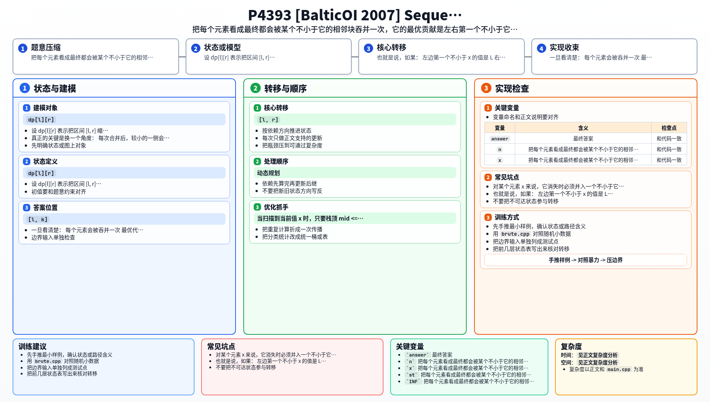

[[TOC]]

### 题意

给定一个序列，每次可以选择一对相邻元素，把它们合并成一个数：

`max(a[i], a[i+1])`

这次操作的代价也等于这个最大值。

经过 `n-1` 次操作后，整个序列会缩成一个数。题目要求最小总代价。

### 思路

先看一个能帮助理解题意的小数据暴力：

@include-code(./brute.cpp, cpp)

`brute.cpp` 用的是区间 DP。

设 `dp[l][r]` 表示把区间 `[l, r]` 缩成一个数的最小代价。

最后一次合并一定是把 `[l, k]` 和 `[k+1, r]` 合在一起，而合并后的值一定是整个区间最大值，所以最后一次代价恒为 `max(l..r)`。

这个思路是对的，但复杂度太高，只能做对拍。

真正的关键是换一个角度：

每次合并后，较小的一侧会“消失”，较大值会保留下来。

所以除了全局最大值外，其他每个元素最终都会在某一步消失一次。

对某个元素 `x` 来说，它消失时必须并入一个不小于它的相邻块。为了让代价最小，它当然应该并到“左右两边第一个不小于它的值”中较小的那个上。

也就是说，如果：

- 左边第一个不小于 `x` 的值是 `L`
- 右边第一个不小于 `x` 的值是 `R`

那么 `x` 的最优贡献就是：

`min(L, R)`

于是问题就转成了一个经典单调栈模型。

维护一个单调递减栈。

当扫描到当前值 `x` 时，只要栈顶 `mid <= x`：

- `x` 就是 `mid` 右边第一个不小于它的值
- 弹出后新的栈顶就是 `mid` 左边第一个不小于它的值

所以这时可以立刻结算：

`mid` 的贡献 = `min(左侧更大值, x)`

扫描结束后，栈中剩下的是一个严格递减序列。它们右边没有更大的值了，只能依次向左并入，因此继续清栈即可。

### 代码

@include-code(./main.cpp, cpp)

### 复杂度

每个元素最多入栈一次、出栈一次。

总时间复杂度：

`O(n)`

空间复杂度：

`O(n)`

### 总结

这题最难的不是写单调栈，而是先把问题重构成“每个元素各自贡献一次代价”。

一旦看清楚：

- 每个元素会被吞并一次
- 最优代价是左右第一个不小于它的值中的较小者

后面的单调栈就是非常自然的线性实现。

### 一图流解析

这张图把本题的建模、关键转移、实现检查和训练方法压缩到一页，适合读完正文后复盘。

