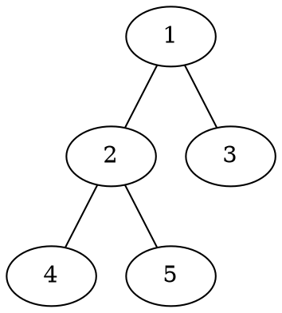
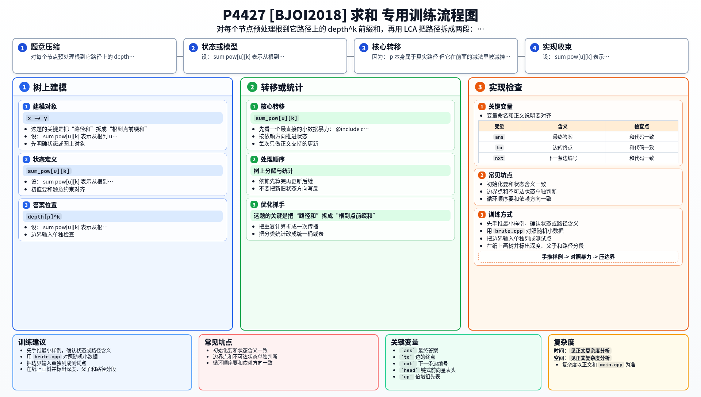

[[TOC]]

### 题意

给一棵以 `1` 为根的树。

每次询问给出 `x, y, k`，要求计算：

- 从 `x` 到 `y` 这条路径上
- 所有节点深度的 `k` 次方和

其中深度定义为：

- 节点到根 `1` 的路径边数

结果对 `998244353` 取模。

#### 样例树

样例树结构如下：

深度分别是：

- `dep[1]=0`
- `dep[2]=1`
- `dep[3]=1`
- `dep[4]=2`
- `dep[5]=2`

比如查询 `4, 5, 1`，路径是 `4-2-5`，答案就是：

- `2^1 + 1^1 + 2^1 = 5`

### 思路

先看一个最直接的小数据暴力：

@include-code(./brute.cpp, cpp)

暴力做法就是：

1. 每次查询找出 `x -> y` 的唯一路径
2. 枚举路径上的每个点
3. 把它的 `depth^k` 累加起来

这个方法最贴近题意，但查询多时会很慢。

这题的关键是把“路径和”拆成“根到点前缀和”。

设：

- `sum_pow[u][k]` 表示从根到 `u` 的路径上，所有节点 `depth^k` 的和

那么对查询 `(x, y, k)`，设 `p = lca(x, y)`，就有：

- 根到 `x` 的前缀和：`sum_pow[x][k]`
- 根到 `y` 的前缀和：`sum_pow[y][k]`
- 根到 `p` 这一段被重复算了两次

所以答案自然是：

`sum_pow[x][k] + sum_pow[y][k] - 2 * sum_pow[p][k] + depth[p]^k`

最后为什么还要加回 `depth[p]^k`？

因为：

- `p` 本身属于真实路径
- 但它在前面的减法里被减掉了两次

于是只要预处理好两样东西：

1. 倍增 LCA
2. 对每个节点、每个 `k (1..50)` 的前缀和

每次查询就能很快回答。

由于 `k` 的范围只有 `50`，所以对每个节点把 `depth^1, depth^2, ..., depth^50` 全部顺手算出来是完全可行的。

### 代码

@include-code(./main.cpp, cpp)

### 复杂度

预处理：

- 倍增祖先表：`O(n log n)`
- 对每个点计算 `1..50` 次幂前缀和：`O(50n)`

每次查询：

- 求一次 LCA：`O(log n)`
- 再算一次 `depth[lca]^k`：`O(k)`，这里 `k <= 50`

总复杂度可以写成：

- `O(n log n + 50n + m(log n + 50))`

空间复杂度：

- `O(n log n + 50n)`

### 总结

这题最重要的观察是：

- 虽然查询里的 `k` 会变化，但它只在 `1..50` 之间

这意味着我们完全可以把每个点对应的 `depth^k` 全部预处理掉。

于是整题就变成非常标准的套路：

1. 倍增求 LCA
2. 根到点前缀和
3. 用 `sum(x)+sum(y)-2sum(lca)+val(lca)` 还原路径和

本质上是一道：

- `LCA + 树上前缀和`

的组合题。

### 一图流解析

这张图把本题的建模、关键转移、实现检查和训练方法压缩到一页，适合读完正文后复盘。

