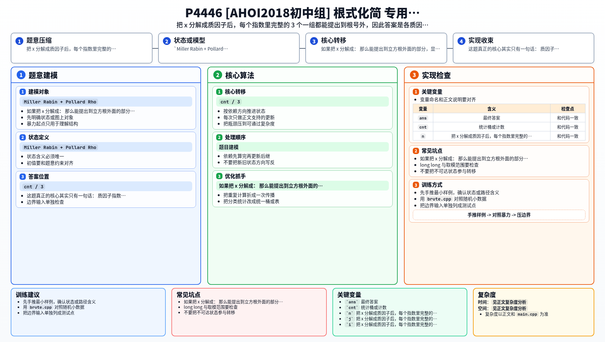

[[TOC]]

### 题意

给出 `n` 个正整数 `x`。

对每个 `x`，要求找最大的整数 `a`，使得存在整数 `b` 满足：

```text
a^3 * b = x
```

只输出这个最大的 `a`。

### 思路

先看一个小数据暴力版：

@include-code(./brute.cpp, cpp)

这题的根式外形其实只是表面。

如果把 `x` 分解成：

```text
x = p1^e1 * p2^e2 * ... * pk^ek
```

那么能提出到立方根外面的部分，显然就是每个指数里完整的 `3` 个一组：

```text
a = p1^(floor(e1 / 3)) * p2^(floor(e2 / 3)) * ... * pk^(floor(ek / 3))
```

所以题目的数学部分很短，真正难点只剩下一个：

- 如何在 `10^18` 范围内快速分解整数

这里使用 `Miller Rabin + Pollard Rho`：

1. `Miller Rabin` 快速判断一个数是不是素数
2. `Pollard Rho` 找一个非平凡因子
3. 递归下去直到全部拆成质因子

分解完成后，把相同质因子出现次数统计出来，再按 `cnt / 3` 把它对答案的贡献乘回去即可。

### 代码

@include-code(./main.cpp, cpp)

### 复杂度

`Pollard Rho` 的严格复杂度不容易写成一个很整齐的式子。

在竞赛中通常认为：

- `Miller Rabin` 判素很快
- `Pollard Rho` 对 `10^18` 范围分解足够高效

空间复杂度很小，可以认为是 `O(log x)` 级别。

### 总结

这题真正的核心其实只有一句话：

- 质因子指数每满 `3` 个，就能给答案贡献一个这个质因子

数学结论本身不难，难点完全在大整数分解实现。


### 一图流解析

这张图把本题的建模、关键转移、实现检查和训练方法压缩到一页，适合读完正文后复盘。


