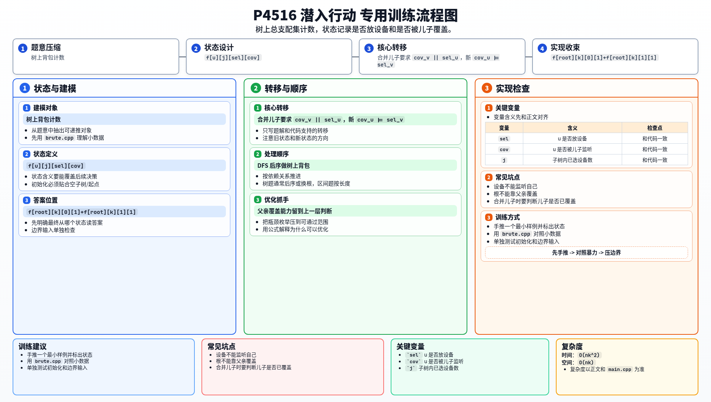

[[TOC]]

### 题意

给一棵树，要恰好在 `k` 个点上放监听设备。

如果在点 `u` 放设备，那么它只能监听 `u` 的相邻点，**不能监听 `u` 自己**。

要求整棵树上每个点都至少被某个相邻点上的设备监听，问合法方案数。

答案对 `10^9+7` 取模。

### 思路

先看一个可以直接验证想法的朴素解：

@include-code(./brute.cpp, cpp)

这就是树上的“总支配集”计数问题。  
由于要求恰好选 `k` 个点，显然要做树上背包。

关键在状态设计。

设：

`f[u][j][sel][cov]`

表示在 `u` 的子树里一共放了 `j` 个设备时：

- `sel=0/1`：`u` 自己是否放设备
- `cov=0/1`：`u` 是否已经被某个儿子监听

为什么只记录“是否被儿子监听”？  
因为 `u` 还能不能被父亲监听，要等合并到父亲时再判断。

初始时：

- `f[u][0][0][0] = 1`
- `f[u][1][1][0] = 1`

合并儿子 `v` 时，只有一种额外约束：

> `v` 这个点必须已经被监听，或者它可以被父亲 `u` 监听。

也就是条件：

`cov_v || sel_u`

同时，`u` 是否被儿子监听，要看是否存在某个儿子放了设备，所以新状态里的 `cov_u` 要和 `sel_v` 做或运算。

最后根节点没有父亲，所以它不能指望父亲来监听。  
因此最终答案只能是：

- `f[root][k][0][1]`
- `f[root][k][1][1]`

这两种状态之和。

#### DP 转移方程

核心状态：

`f[u][j][sel][cov]`

核心转移：

合并儿子要求 `cov_v || sel_u`，新 `cov_u |= sel_v`

答案收束：

`f[root][k][0][1]+f[root][k][1][1]`

### 代码

@include-code(./main.cpp, cpp)

### 复杂度

时间复杂度 `O(nk^2)`，空间复杂度 `O(nk)`。

这里 `k <= 100`，可以通过。

### 总结

这题最关键的是看清：

- 一个点是否放设备
- 一个点是否已经被儿子覆盖

只要这两个状态定清楚，合并儿子的条件就是一句：

`cov_v || sel_u`

### 一图流解析

这张图把本题的建模、关键转移、实现检查和训练方法压缩到一页，适合读完正文后复盘。

