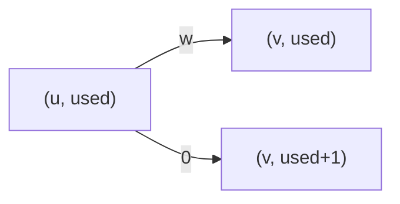

[[TOC]]

### 题意

给你一张无向带权图，点编号是 `0 .. n-1`。  
现在要从 `s` 走到 `t`。

你最多可以选择 `k` 条航线免费乘坐。  
问最小花费是多少。

### 思路

先看一个更直观的小数据暴力：

@include-code(./brute.cpp, cpp)

`brute.cpp` 会把“已经用了多少次免费机会”展开成若干层：

- 第 `0` 层：还没用免费机会
- 第 `1` 层：已经用了 `1` 次
- ...
- 第 `k` 层：已经用了 `k` 次

原图里的一条边 `u <-> v`，在分层图里对应两种走法：

1. 正常乘坐：
   - 留在当前层
   - 花费原边权
2. 免费乘坐：
   - 跳到下一层
   - 花费 `0`

这题和 `P2939` 几乎是同一个模型，只是那里讲的是“改造道路”，这里讲的是“免费航线”。

#### 状态定义

设：

- `dist[u][used]` 表示到达城市 `u`，并且已经用了 `used` 次免费机会时的最小花费

那么沿一条边走到 `v` 时，有两种转移：

1. 正常走：
   - `(u, used) -> (v, used)`
   - 代价加 `w`
2. 如果 `used < k`，免费走：
   - `(u, used) -> (v, used + 1)`
   - 代价加 `0`

这张图展示的就是这个转移：

图里每下降一层，就代表多消耗了一次免费航线的机会。  
留在本层，则说明这条航线正常付费。

因为所有边权都非负，所以在这个状态图上直接跑 Dijkstra 就可以了。

最后答案不是只看 `dist[t][k]`，而是：

- `dist[t][0..k]` 的最小值

因为免费机会不一定要全部用完。

### 代码

@include-code(./main.cpp, cpp)

### 复杂度

状态数：

- `N × (K + 1)`

每条边在每层产生常数次转移，因此总复杂度大致是：

- `O(KM log (NK))`

空间复杂度：

- `O(NK)`

### 总结

这题本质上就是一题状态最短路。

关键只在于把“已经用了几次免费机会”写进状态。  
一旦状态定义清楚，后面就是标准的 Dijkstra。
