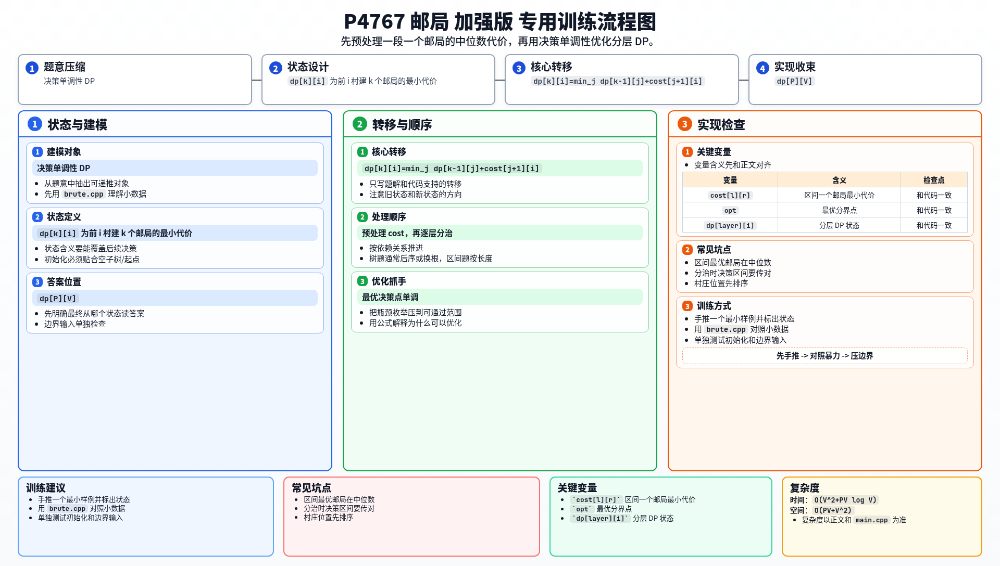

[[TOC]]

### 题意

一条数轴上有 `V` 个村庄，位置已知，要在其中一些村庄上建 `P` 个邮局。

每个村庄会去离自己最近的邮局，要求所有村庄到最近邮局的距离和最小。

### 思路

先看一个可以直接验证想法的朴素解：

@include-code(./brute.cpp, cpp)

先把村庄位置排序。

如果一段连续村庄 `[l, r]` 只建一个邮局，最优位置一定在中位数村庄。

所以可以先预处理：

- `cost[l][r]`：负责区间 `[l, r]` 的所有村庄时，只建一个邮局的最小总代价

接下来做 DP。

设：

- `dp[k][i]`：前 `i` 个村庄建 `k` 个邮局时的最小总代价

最后一个邮局负责区间 `[j+1, i]`，则有转移：

`dp[k][i] = min(dp[k-1][j] + cost[j+1][i])`

朴素枚举 `j` 的复杂度是 `O(PV^2)`，这里会超时。

这题满足决策单调性，可以用分治优化。

也就是说：

- `dp[k][i]` 的最优决策点
- 不会在 `i` 变大时向左跳

于是每一层 `k` 的 DP，都可以用一次分治递归在 `O(V log V)` 次状态里完成，每个状态只在一个较小的决策区间里找最优值。

所以整体就能通过 `V <= 3000` 的数据。

#### DP 转移方程

核心状态：

`dp[k][i]` 为前 i 村建 k 个邮局的最小代价

核心转移：

`dp[k][i]=min_j dp[k-1][j]+cost[j+1][i]`

答案收束：

`dp[P][V]`

### 代码

@include-code(./main.cpp, cpp)

### 复杂度

预处理 `cost` 是 `O(V^2)`。

DP 分治优化总复杂度大致是 `O(PV log V)`。

空间复杂度是 `O(PV + V^2)`。

### 总结

这题是经典“邮局问题”。

核心分两步：

1. 先把“一段村庄只建一个邮局”的代价预处理出来
2. 再把多邮局问题写成分层 DP，并利用决策单调性优化

理解这题之后，很多“四边形不等式 / 决策单调性”的 DP 都会更容易上手。

### 一图流解析

这张图把本题的建模、关键转移、实现检查和训练方法压缩到一页，适合读完正文后复盘。

