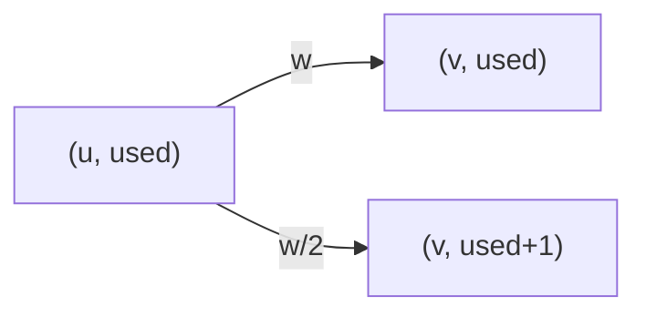

[[TOC]]

### 题意

给你一张无向带权图，从 `1` 走到 `N`。

你有最多 `K` 张卡。  
每张卡只能在一条边上使用一次，效果是把这条边的通过时间减半。

要求输出从 `1` 到 `N` 的最小时间。  
不要求把卡全部用完。

### 思路

先看一个更直观的小数据暴力：

@include-code(./brute.cpp, cpp)

`brute.cpp` 直接把“用了几张卡”这件事展开成分层图：

- 第 `0` 层：一张卡都还没用
- 第 `1` 层：已经用过 `1` 张
- ...
- 第 `K` 层：已经用过 `K` 张

如果原图里有一条边 `u <-> v`，那么在分层图里就有两种走法：

1. 不用卡：
   - 还留在当前层
   - 花费原边权
2. 用卡：
   - 跳到下一层
   - 花费原边权的一半

这个思路完全贴着题意，但直接把整张分层图展开出来再跑 Floyd，只适合很小的数据。

真正的主解不必显式建出整张分层图，只需要把状态写进 Dijkstra 里。

#### 状态定义

设：

- `dist[u][used]` 表示到达城市 `u`，并且已经用了 `used` 张卡时的最短时间

那么从 `(u, used)` 走一条边到 `v` 时，有两种转移：

1. 不用卡：
   - 到 `(v, used)`
   - 代价加 `w`
2. 如果 `used < K`，还可以用卡：
   - 到 `(v, used + 1)`
   - 代价加 `w / 2`

这个过程可以用下面这张图来理解：

图里每一次“向下一层”就代表多消耗了一张卡。  
而“留在本层”则表示这条边正常通过。

因为所有边权都非负，所以在这个状态图上直接跑 Dijkstra 就可以了。

最后答案不是只看 `dist[N][K]`，而是：

- `dist[N][0..K]` 的最小值

因为卡片可以不用完。

### 代码

@include-code(./main.cpp, cpp)

### 复杂度

状态数是：

- `N × (K + 1)`

每条原图边在每一层里都会产生常数条转移。  
因此总复杂度大致是：

- `O(KM log (NK))`

在本题 `N <= 50, M <= 1000, K <= 50` 的范围内完全足够。

空间复杂度：

- `O(NK)`

### 总结

这题最重要的不是“边权减半”本身，而是把它翻译成状态。

一旦你把“已经用了多少张卡”加进状态里，问题就重新变回了最熟悉的那种：

- 非负权状态图最短路

所以它本质上是一道非常标准的分层图 / 状态最短路题。
