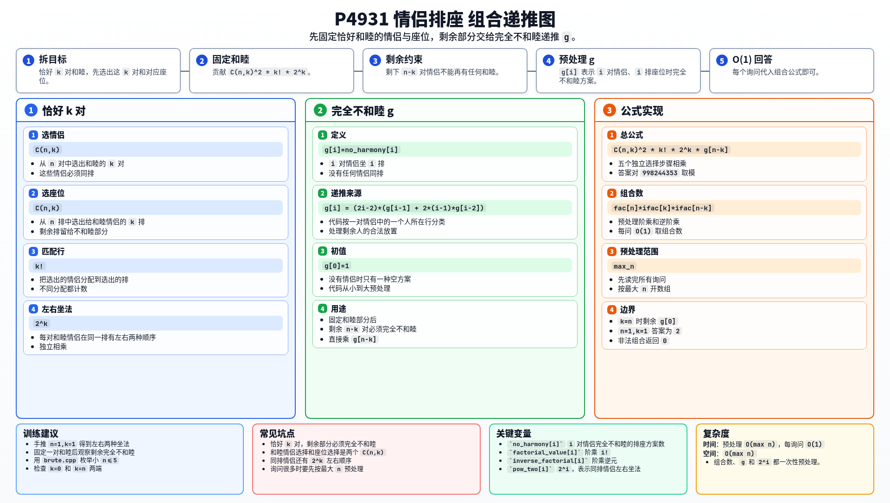

[[TOC]]

### 题意

有 `n` 对情侣和 `n` 排座位，每排两个座位。所有人坐满后，如果一对情侣坐在同一排，就称这对情侣和睦。问恰好 `k` 对情侣和睦的排座方案数。

### 思路

朴素做法是枚举所有 `(2n)!` 种座位排列，再统计和睦情侣数量。

先看一个可以直接验证想法的朴素解：

@include-code(./brute.cpp, cpp)

大数据下需要组合计数。设 `g[i]` 表示 `i` 对情侣坐 `i` 排座位，并且没有任何一对情侣同排的方案数。

这个数组可以递推预处理：

```text
g[0] = 1
g[1] = 0
g[i] = 4*i*(i-1) * (g[i-1] + 2*(i-1)*g[i-2])
```

它的作用是处理“剩余情侣完全不和睦”的部分。

现在统计恰好 `k` 对和睦：

1. 从 `n` 对情侣中选出和睦的 `k` 对：`C(n,k)`；
2. 从 `n` 排座位中选出给这些情侣的 `k` 排：`C(n,k)`；
3. 把这 `k` 对情侣匹配到这 `k` 排：`k!`；
4. 每对情侣在同一排内有左右两种坐法：`2^k`；
5. 剩余 `n-k` 对情侣和剩余 `n-k` 排不能再产生和睦：`g[n-k]`。

因此答案为：

```text
C(n,k)^2 * k! * 2^k * g[n-k]
```

### 代码

@include-code(./main.cpp, cpp)

### 复杂度

预处理时间 `O(max n)`，每个询问 `O(1)`。

空间复杂度 `O(max n)`。

### 总结

恰好 `k` 对和睦的问题，关键是先把这 `k` 对固定出来，再把剩余部分变成“完全不和睦”的子问题。`g[i]` 预处理好后，每个询问就是一条组合公式。

### 一图流解析

这张图把本题的建模、关键转移、实现检查和训练方法压缩到一页，适合读完正文后复盘。


