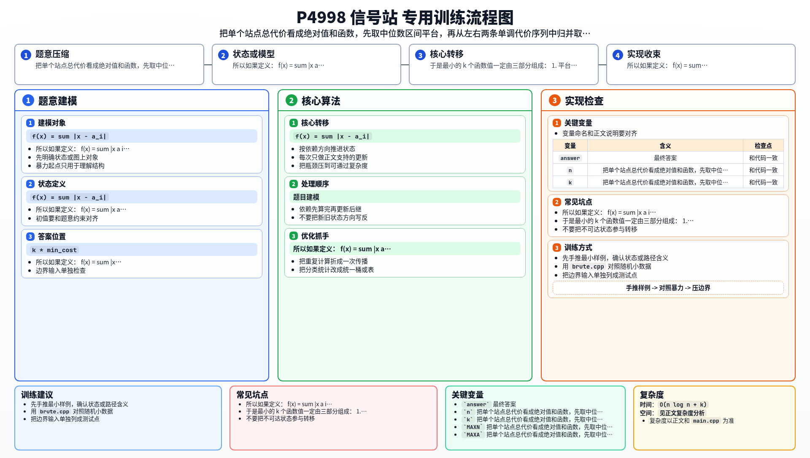

[[TOC]]

### 题意

数轴上有 `n` 户人家，位置为 `a_i`。

现在要建 `k` 个信号站，每个站必须放在不同的整数位置上。

如果某个信号站建在位置 `x`，它的不合理值是：

- `sum |x - a_i|`

题目要求这 `k` 个信号站不合理值之和最小。

### 思路

先看一个可以直接验证想法的朴素解：

@include-code(./brute.cpp, cpp)

本题最重要的观察是：多个信号站之间并不会分摊住户。

所以如果定义：

- `f(x) = sum |x - a_i|`

那么题目其实就是：

- 从所有整数位置里选 `k` 个不同的 `x`
- 使 `f(x)` 的和最小

接下来只要研究这个一维函数 `f(x)` 的形状。

对于绝对值和函数，最小值一定出现在中位数区间：

- `[a_{(n+1)/2}, a_{(n+2)/2}]`

并且这个区间内的所有整数位置，函数值都相同。

这说明最小的候选位置先是一整段“平坦平台”。

再看平台两边：

- 往左越远，代价单调不降；
- 往右越远，代价也单调不降。

于是最小的 `k` 个函数值一定由三部分组成：

1. 平台内部的所有位置
2. 平台左边若干个最近位置
3. 平台右边若干个最近位置

如果平台长度已经不少于 `k`，
那答案就是：

- `k * min_cost`

否则先把平台全取上，
然后从左右两边的两条单调代价序列里归并取出最小的剩余若干项即可。

### 代码

@include-code(./main.cpp, cpp)

### 复杂度

排序 `O(n log n)`，
之后求平台和左右归并共 `O(n + k)`，
总时间复杂度 `O(n log n + k)`。

### 总结

这题关键不在“放多个站”，而在先把问题改写成：

- 取函数 `f(x) = sum |x-a_i|` 的前 `k` 小整数点值。

一旦看到 `f(x)` 是中位数平台加左右单调上升的形状，
后面的做法就很自然了。

### 一图流解析

这张图把本题的建模、关键转移、实现检查和训练方法压缩到一页，适合读完正文后复盘。

