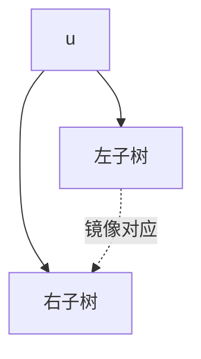

[[TOC]]

### 题意

给出一棵有点权的二叉树，要求找出其中节点数最多的一棵对称子树。

这里“对称”指的是：把整棵子树的左右儿子全部交换后，结构仍然对应，且对应节点权值也相等。

### 思路

最直接的办法是枚举每个节点，暴力比较它的左子树和右子树是否镜像相同。

先看一个可以直接验证想法的朴素解：

@include-code(./brute.cpp, cpp)

`brute.cpp` 用 `mirror_same(a, b)` 直接递归比较左右两棵子树是否镜像一致，逻辑很直观。但这样会重复比较很多相同子结构，面对 `10^6` 规模不够稳。

#### 镜像关系

这张图展示对称判断时要比较的对应关系：

判断一棵子树是否对称，本质上是在问：
左子树和右子树在镜像意义下是否完全一致。
如果每次都真的深入比较整棵子树，会做很多重复工作。

更好的办法是先为每棵子树准备两种摘要：

- 正常表示：按“左、右”顺序描述这棵子树
- 镜像表示：按“右、左”顺序描述这棵子树

于是：

- 如果 `normal[u] == mirror[u]`，说明以 `u` 为根的整棵子树对称

所以正式解做一次后序遍历即可：

1. 先处理左右儿子
2. 组合得到当前节点的正常表示和镜像表示
3. 若两种表示相同，则这棵子树对称
4. 用子树大小更新答案

代码里使用双哈希保存这两种表示，并用迭代后序遍历避免深递归爆栈。

### 代码

@include-code(./main.cpp, cpp)

### 复杂度

每个节点只在后序过程中被处理常数次，所以总时间复杂度是 `O(n)`，空间复杂度也是 `O(n)`。

### 总结

这题的核心不是“如何一棵棵比较子树”，而是“如何给子树做摘要表示”。一旦能快速判断“原树摘要”和“镜像摘要”是否一致，最大对称子树就能在线性时间内找出来。
