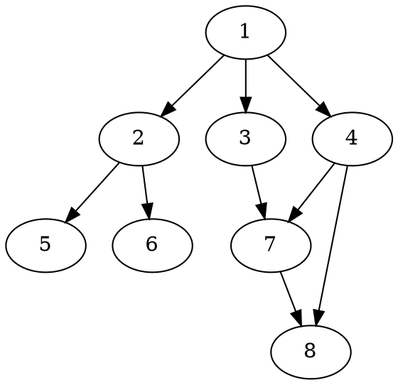
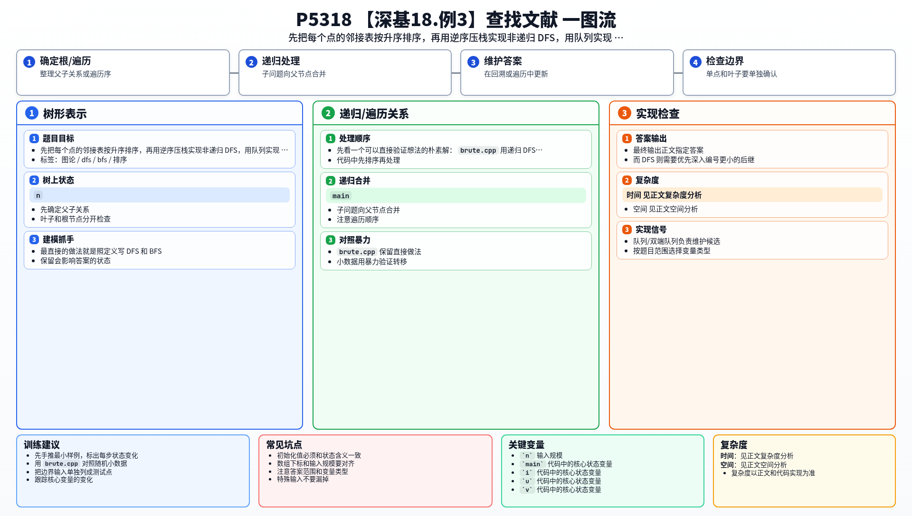

[[TOC]]

### 题意

给出一个有向图，从 `1` 号点出发，分别输出：

- 按题目要求进行的 DFS 遍历顺序
- 按题目要求进行的 BFS 遍历顺序

如果某一步有多个可选点，必须先访问编号较小的那个。

### 思路

最直接的做法就是照定义写 DFS 和 BFS。

先看一个可以直接验证想法的朴素解：

@include-code(./brute.cpp, cpp)

`brute.cpp` 用递归 DFS 和普通队列 BFS 实现了最直观的版本，适合小图对拍。

真正需要注意的是访问顺序和栈深：

1. 邻接表必须先按升序排序
2. BFS 直接按升序扩展邻居即可
3. 正式解里的 DFS 不建议用递归，因为 `n` 可达 `1e5`

这张图展示样例结构：

从图里可以看出，BFS 很自然是一层一层访问；而 DFS 则需要优先深入编号更小的后继。所以正式解采用“邻接表升序 + 逆序压栈”的方式，用显式栈模拟递归 DFS 的顺序。

### 代码

@include-code(./main.cpp, cpp)

### 复杂度

建图后需要对邻接表排序，然后各做一次 DFS 和 BFS。总体时间复杂度是 `O(m log m + n + m)`，空间复杂度是 `O(n + m)`。

### 总结

这题本身不难，关键在两个实现细节：邻接表要排序，非递归 DFS 要逆序压栈。把这两个点处理好，答案就稳定了。

### 一图流解析

这张图把本题的建模、关键转移、实现检查和训练方法压缩到一页，适合读完正文后复盘。

