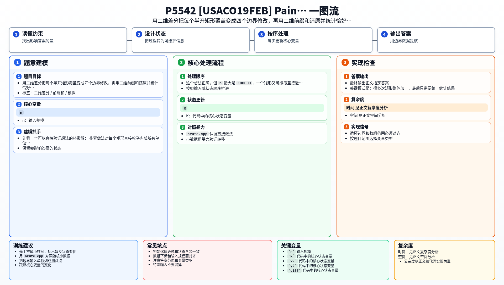

[[TOC]]

### 题意

给出 `n` 个坐标轴平行的矩形，每个矩形表示一次涂色区域。

矩形 `(x1, y1, x2, y2)` 覆盖的是半开区域 `[x1,x2) * [y1,y2)`，也就是所有左下角坐标满足 `x1 <= x < x2` 且 `y1 <= y < y2` 的单位小方格。

要求统计所有矩形涂完后，恰好被涂了 `K` 层的单位面积数量。

### 思路

先看一个可以直接验证想法的朴素解：

@include-code(./brute.cpp, cpp)

朴素做法对每个矩形直接枚举内部所有单位小方格。这个想法正确，但 `n` 最大是 `100000`，一个矩形又可能覆盖接近 `1000 * 1000` 个格子，逐格修改会超时。

这题的关键模式是：很多次矩形整体加一，最后只需要统一统计结果。根据 rbook 的《差分》文章，这正适合用二维差分：每次矩形修改只改四个边界点，所有修改结束后再做一次二维前缀和还原。二维前缀和的还原方式也可以参考 rbook 的《前缀和》文章。

对一个半开矩形 `[x1,x2) * [y1,y2)`，差分数组这样修改：

```text
diff[x1][y1] += 1
diff[x2][y1] -= 1
diff[x1][y2] -= 1
diff[x2][y2] += 1
```

注意这里不是 `x2 + 1`、`y2 + 1`。题目里的右上角本来就不属于涂色区域，所以 `x2` 和 `y2` 正好是影响停止的位置。

#### 四个点的作用

这张表说明一次半开矩形加一时，四个差分点各自负责什么。

| 差分点 | 操作 | 含义 |
| --- | --- | --- |
| `(x1, y1)` | `+1` | 从矩形左下角开始，让右上方向的格子多一层 |
| `(x2, y1)` | `-1` | 从右边界开始，取消继续向右的影响 |
| `(x1, y2)` | `-1` | 从上边界开始，取消继续向上的影响 |
| `(x2, y2)` | `+1` | 右上区域被取消了两次，需要补回来 |

最后从小到大扫描 `diff`，用二维前缀和公式原地还原覆盖次数。若当前点 `(x,y)` 是一个真实单位格子的左下角，也就是 `x < 1000` 且 `y < 1000`，就判断它的覆盖次数是否等于 `K`。

### 代码

@include-code(./main.cpp, cpp)

### 复杂度

设坐标上界为 `C = 1000`。

- 每个矩形只做四次差分修改，处理所有矩形是 `O(n)`。
- 还原并统计整个网格是 `O(C^2)`。
- 总时间复杂度 `O(n + C^2)`。
- 空间复杂度 `O(C^2)`。

### 总结

这题和普通二维差分模板最大的细节区别，是矩形坐标表示半开区域。

只要确认了覆盖的是 `[x1,x2) * [y1,y2)`，四个差分点就自然落在 `(x1,y1)`、`(x2,y1)`、`(x1,y2)`、`(x2,y2)`。最后扫描时也要只统计 `0..999` 的单位格子，不能把坐标边界 `1000` 当成面积。

### 一图流解析

这张图把本题的建模、关键转移、实现检查和训练方法压缩到一页，适合读完正文后复盘。


