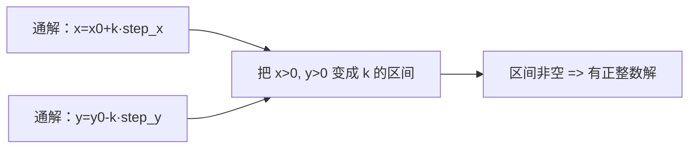

[[TOC]]

### 题意

给定方程：

`a x + b y = c`

需要分情况输出：

1. 若无整数解，输出 `-1`
2. 若有正整数解，输出正整数解个数，以及这些正整数解里 `x/y` 的最小值和最大值
3. 若有整数解但没有正整数解，输出所有整数解里 `x` 的最小正整数值、`y` 的最小正整数值

### 思路

先看一个更直接的小数据暴力：

@include-code(./brute.cpp, cpp)

暴力版在一个小范围里枚举所有 `x, y`，直接检查：

`a x + b y == c`

这样写能帮助理解输出含义，但显然不能处理大数据。

关键观察还是扩展欧几里得的标准结论：

若：

`d = gcd(a, b)`

那么方程：

`a x + b y = c`

有整数解的充要条件是：

- `d` 能整除 `c`

如果不能整除，直接输出 `-1`。

若能整除，先用 exgcd 求出：

`a x0 + b y0 = d`

再整体乘上 `c / d`，得到一组特解。

#### 通解形式

设：

- `step_x = b / d`
- `step_y = a / d`

则所有整数解都可以写成：

- `x = x0 + k * step_x`
- `y = y0 - k * step_y`

这里 `k` 是任意整数。

#### 正整数解怎么求

若要求 `x > 0, y > 0`，只要把这两个条件分别改写成对 `k` 的不等式：

1. `x0 + k * step_x >= 1`
2. `y0 - k * step_y >= 1`

于是就能得到：

- `k` 的下界
- `k` 的上界

如果下界不超过上界，就说明有正整数解。

这张图表达的就是这个过程：

图里真正要看的，是“问题已经不再是求 `x,y`”，而是转成了“求参数 `k` 的合法范围”。

#### 没有正整数解时输出什么

若整数解存在，但正整数解区间为空，那么题目要求输出：

- 所有整数解中 `x` 的最小正整数值
- 所有整数解中 `y` 的最小正整数值

这其实就是：

- `x` 在模 `step_x` 意义下的最小正剩余
- `y` 在模 `step_y` 意义下的最小正剩余

### 代码

@include-code(./main.cpp, cpp)

### 复杂度

每组数据主要是一次 exgcd 和若干常数次计算：

- `O(log max(a,b))`

空间复杂度：

- `O(1)`

### 总结

这题最核心的不是 exgcd 本身，而是通解形式：

- `x = x0 + k * b/d`
- `y = y0 - k * a/d`

一旦把这个通解写出来，后面所有输出要求都只是围绕 `k` 的范围做分类讨论。
