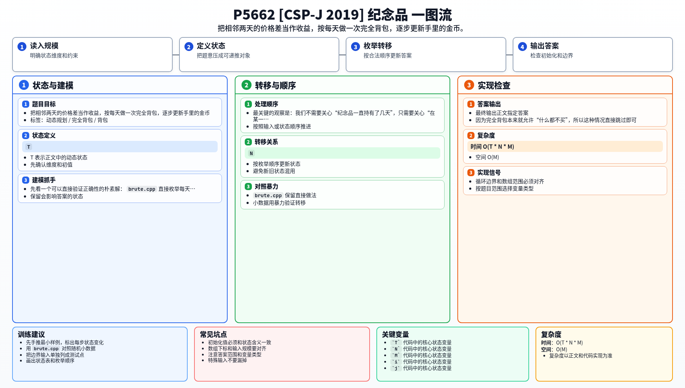

[[TOC]]

### 题意

有 `T` 天、`N` 种纪念品，初始有 `M` 枚金币。

第 `i` 天，第 `j` 种纪念品的价格是 `P[i][j]`。每天可以无限次买卖任意纪念品，同一天里卖掉得到的金币可以立刻继续买别的纪念品。

第 `T` 天结束后，所有纪念品都必须卖掉。

要求最后拥有的金币数尽量多。

这张表把题意翻成了背包模型：

| 原题对象 | 背包含义 |
| --- | --- |
| 当前金币数 | 背包容量 |
| 纪念品的买入价 | 物品重量 |
| 相邻两天的价格差 | 物品价值 |
| 每天可无限次买卖 | 完全背包 |

### 思路

先看一个可以直接验证正确性的朴素解：

@include-code(./brute.cpp, cpp)

`brute.cpp` 直接枚举每天能买多少件、怎么组合，能正确反映题意，但只适合小数据。

这题最关键的观察是：我们不需要关心“纪念品一直持有了几天”，只需要关心“在某一天和下一天之间，哪些纪念品值得持有”。

也就是说，考虑相邻两天 `i` 和 `i + 1`：

- 如果某个纪念品今天买入、明天卖出，那么每件的收益就是 `P[i+1][j] - P[i][j]`
- 买入时消耗的是 `P[i][j]`
- 同一天可以买很多件，所以是完全背包

这张表说明一个日间转移的含义：

| 状态 | 含义 |
| --- | --- |
| `money` | 当前手里的金币 |
| `dp[x]` | 用不超过 `x` 枚金币，在这一段时间里能额外赚到的最大金币 |
| `P[i][j]` | 今天买入这一件的代价 |
| `P[i+1][j] - P[i][j]` | 持有到明天再卖出的净收益 |

于是每天都可以做一次完全背包：

1. 以当天手里的金币 `money` 作为容量
2. 对每个纪念品，重量是今天的价格，价值是明天比今天多赚的钱
3. 跑完完全背包后，`dp[money]` 就是这一晚最多能多赚的金币
4. 令 `money += dp[money]`，进入下一天

如果某个纪念品的净收益不是正数，就不选它。
因为完全背包本来就允许“什么都不买”，所以这种情况直接跳过即可。

#### DP 公式

处理第 $i$ 天到第 $i+1$ 天时，当前金币为 $money$。设 $dp_x$ 表示用不超过 $x$ 枚金币在这一晚能额外赚到的最大金币。对第 $j$ 种纪念品：

$$
weight=P_{i,j},\quad value=P_{i+1,j}-P_{i,j}
$$

若 $value>0$，做完全背包转移：

$$
dp_x=\max(dp_x,\ dp_{x-weight}+value)
$$

这一晚结束后：

$$
money\leftarrow money+dp_{money}
$$

公式解释：一天到下一天之间，买入价是容量消耗，价格差是收益。每天用当前金币做一次完全背包，算出这一晚最多能赚多少，再把收益加入金币进入下一天。

### 代码

@include-code(./main.cpp, cpp)

### 复杂度

- 时间复杂度：`O(T * N * M)`
- 空间复杂度：`O(M)`

这里 `M <= 10^3`，`T <= 100`，`N <= 100`，所以这个复杂度足够。

### 总结

这题表面上是“买纪念品”，本质上是“每天都做一次完全背包”。

真正要抓住的是两点：

1. 物品重量是今天的买入价
2. 物品价值是明天和今天的价格差

把每天的最优增益算出来，再把金币滚动更新，就能得到最终答案。

### 一图流解析

这张图把本题的建模、关键转移、实现检查和训练方法压缩到一页，适合读完正文后复盘。

