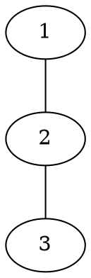

[[TOC]]

### 题意

给出一个无向图。对每张工单 `(a, L)`，问 `1` 号工人会不会在“第 `L` 层传播”里被卷入，从而需要给别人提供原材料。

### 思路

最直接的办法是按层数逐层扩展，做一个“恰好走 `step` 步能到哪些点”的 DP。

先看一个可以直接验证想法的朴素解：

@include-code(./brute.cpp, cpp)

`brute.cpp` 用 `can[step][u]` 直接表示恰好 `step` 步能否到点 `u`，适合小数据对拍，但正式数据里 `L` 可达 `1e9`，显然不能这样推。

关键观察是：工单 `(a, L)` 等价于问“从 `1` 到 `a` 是否存在长度恰好为 `L` 的游走”。在无向图中，只要某种奇偶性的路径存在，就可以通过沿一条边来回走，把长度每次多补 `2`。

因此只需要知道：

- 到每个点的最短偶数步长度
- 到每个点的最短奇数步长度

这张图展示样例 1 的链结构：

从这张图可以看出：

- 到 `1` 的偶数步最短是 `0`
- 到 `2` 的奇数步最短是 `1`
- 到 `3` 的偶数步最短是 `2`

一旦这些最短同奇偶步数知道了，查询 `(a, L)` 时，只要 `dist[a][L mod 2] <= L`，就说明可以先走最短那条同奇偶路径，再通过“来回两步”把长度补到正好 `L`。

只有 `a = 1` 且 `L` 为偶数时要额外小心：`dist[1][0] = 0` 只是空路径，不能算作真的发生了一次传播。因此这里必须要求存在正长度偶数游走；无向图里只要 `1` 号点有邻边，最短这种游走就是 `2`。

实现时，把每个点拆成两个状态 `(u,0)` 和 `(u,1)`，表示走到 `u` 时步数奇偶为 `0/1`。从 `(1,0)` 出发做 BFS，每经过一条边就翻转奇偶。

### 代码

@include-code(./main.cpp, cpp)

### 复杂度

分层图只有 `2n` 个状态，BFS 是 `O(n + m)`，每个查询是 `O(1)`，总复杂度是 `O(n + m + q)`。

### 总结

这题的关键不是按层硬模拟，而是把问题转成“同奇偶最短游走”。抓住“无向图里可以随时补两步”这个性质后，答案就只剩一次奇偶分层 BFS。
