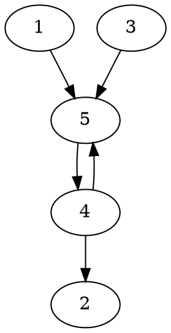
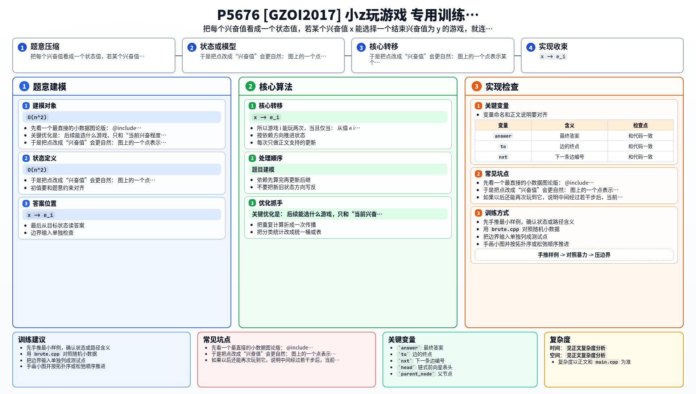

[[TOC]]

### 题意

有 `N` 个游戏。

- 第 `i` 个游戏的“看上去有趣程度”是 `w_i`
- 玩完它以后，兴奋程度会变成 `e_i`

小 z 只会玩那些满足下面条件的游戏：

- 当前兴奋程度 `x` 能整除这个游戏的 `w_i`

初始兴奋程度是 `1`。

问有多少个游戏“有可能被玩两次”。

这里的“可能”表示：

- 存在某种选择顺序
- 让这个游戏在整条序列中出现至少两次

#### 样例图

用样例二来画状态转移图更直观。  
样例二的 5 个游戏是：

- `w = [2, 3, 5, 35, 21]`
- `e = [7, 11, 7, 3, 2]`

这张图展示“玩完一个游戏后，下一步还能选哪些游戏”：

其中 `2,4,5` 之间能绕成环，所以它们可能被再次玩到。
而 `1`、`3` 虽然能走出去，但回不来，所以不能玩第二次。

### 思路

先看一个最直接的小数据图论版：

@include-code(./brute.cpp, cpp)

`brute.cpp` 的想法是：

1. 把每个游戏看成一个点
2. 如果玩完游戏 `i` 后，兴奋值 `e_i` 能整除 `w_j`，就连边 `i -> j`
3. 某个游戏能玩两次，当且仅当它所在的图里存在回路能回到自己

所以在这个“游戏图”里，答案就是：

- 处在非平凡强连通分量里的点
- 或者自己有自环的点

这个建模是对的，但如果直接建游戏图，边数最坏可能是 `O(n^2)`，撑不住。

关键优化是：  
后续能选什么游戏，只和“当前兴奋程度”有关，和你刚才玩的是哪个游戏无关。

于是把点改成“兴奋值”会更自然：

- 图上的一个点表示某个可能出现的兴奋值
- 如果当前兴奋值是 `x`，存在某个游戏满足 `x | w_i`，且玩完后兴奋值变成 `e_i`
- 那么就在值图里连边 `x -> e_i`

现在考虑某个具体游戏 `i` 什么时候能玩两次。

第一次玩完它以后，兴奋值会变成 `e_i`。  
如果以后还能再次玩到它，说明中间经过若干步后，当前兴奋值一定变成了某个 `x`，并且：

- `x` 能整除 `w_i`

这样才能再次选择游戏 `i`。

所以游戏 `i` 能玩两次，当且仅当：

- 从值 `e_i` 出发，能够走到某个整除 `w_i` 的值 `x`

而一旦有这样的 `x`，由于“再次玩游戏 `i`”本身就对应一条边 `x -> e_i`，所以：

- `x` 和 `e_i` 一定在同一个强连通分量里

于是判定条件就变成了：

- 枚举 `w_i` 的所有约数里，哪些本身是某个出现过的兴奋值
- 只要其中有一个约数值和 `e_i` 属于同一个 SCC，游戏 `i` 就能玩两次

这样我们只需要在“不同兴奋值个数”这层图上跑一次 SCC，复杂度就降下来了。

### 代码

@include-code(./main.cpp, cpp)

### 复杂度

设不同兴奋值个数为 `K`。

值图上的节点数是 `K`，建边时只会枚举每个 `w_i` 的约数，所以：

- 时间复杂度主要是 `O(总约数枚举 + K + 边数)`
- 在本题范围内可以视为线性到近线性

空间复杂度：

- `O(K + 边数)`

### 总结

这题最重要的转化不是 Tarjan 本身，而是：

- 后续可选游戏只取决于当前兴奋值，不取决于上一个游戏是谁

一旦把“游戏图”压成“兴奋值图”，问题就变成了一个很标准的 SCC 判定：

1. 建值图
2. 跑强连通分量
3. 对每个游戏检查：`w_i` 的某个约数值，是否和 `e_i` 在同一个 SCC

这样就把原本看起来像博弈/搜索的问题，改写成了纯图论题。

### 一图流解析

这张图把本题的建模、关键转移、实现检查和训练方法压缩到一页，适合读完正文后复盘。

