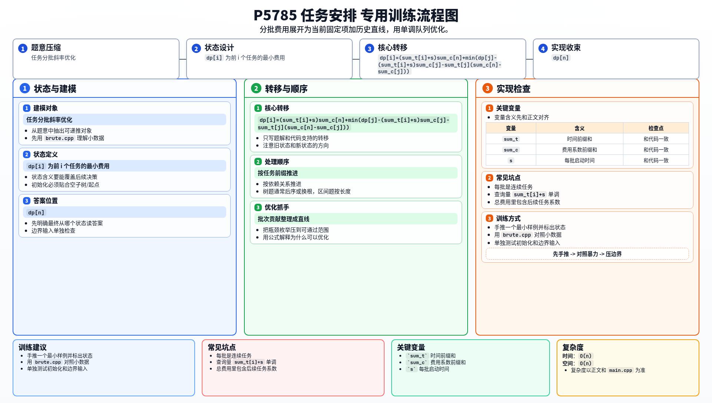

[[TOC]]

### 题意

给定一列任务，要把它们分成若干连续批次处理。

每批开始前要先花 `s` 的启动时间。

同一批中的所有任务会在同一时刻完成，而每个任务会产生：

`完成时刻 * C_i`

的费用。

目标是让总费用最小。

### 思路

先看最直接的暴力 DP：

@include-code(./brute.cpp, cpp)

设：

- `sum_t[i]` 表示前 `i` 个任务处理时间之和
- `sum_c[i]` 表示前 `i` 个任务费用系数之和

如果最后一批是 `j+1..i`，那么这一批的贡献可以整理成：

`dp[i] = min(dp[j] + (sum_t[i]-sum_t[j])(sum_c[n]-sum_c[j]) + s(sum_c[n]-sum_c[j]))`

继续整理：

`dp[i] = (sum_t[i]+s)sum_c[n] + min(dp[j] - (sum_t[i]+s)sum_c[j] - sum_t[j](sum_c[n]-sum_c[j]))`

对固定 `j` 而言，后面这一项是关于 `sum_t[i] + s` 的一次函数。

于是可以把每个决策点 `j` 看成一条线，再用单调队列维护下凸壳。

由于：

- 查询量 `sum_t[i] + s` 单调递增
- 斜率 `sum_c[j]` 单调递增

所以总复杂度可以降到 `O(n)`。

#### DP 转移方程

核心状态：

`dp[i]` 为前 i 个任务的最小费用

核心转移：

`dp[i]=(sum_t[i]+s)sum_c[n]+min(dp[j]-(sum_t[i]+s)sum_c[j]-sum_t[j](sum_c[n]-sum_c[j]))`

答案收束：

`dp[n]`

### 代码

@include-code(./main.cpp, cpp)

### 复杂度

时间复杂度 `O(n)`，空间复杂度 `O(n)`。

### 总结

这题和很多“任务安排”类题一样，真正的关键是把：

- 一批任务的整体贡献

写成前缀和形式，再把它整理成：

- 当前状态固定部分
- 历史决策点形成的直线部分

这样斜率优化就出来了。

### 一图流解析

这张图把本题的建模、关键转移、实现检查和训练方法压缩到一页，适合读完正文后复盘。

