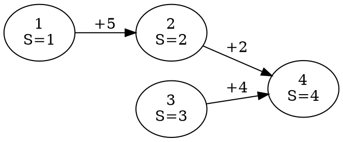
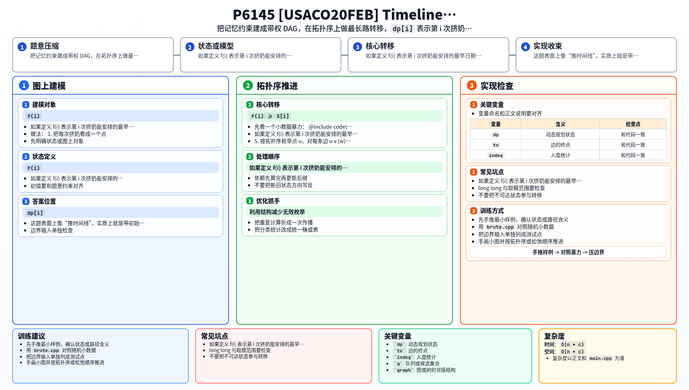

[[TOC]]

### 题意

有 `n` 次挤奶，第 `i` 次挤奶最早不能早于 `S[i]` 这一天。

另外有若干条记忆 `(a, b, x)`，表示第 `b` 次挤奶至少要在第 `a` 次挤奶之后 `x` 天进行，也就是：

`day[b] >= day[a] + x`

题目保证这些记忆没有矛盾。要求输出每一次挤奶在满足所有条件时的最早日期。

#### 样例图

这张图把样例中的下界和依赖关系画出来：

例如点 `2` 本来下界是 `2`，但因为 `2 >= 1 + 5`，所以它至少要到第 `6` 天。
点 `4` 既要满足 `4 >= 2 + 2`，又要满足 `4 >= 3 + 4`，所以要取这些限制中的最大值，最后得到 `8`。

### 思路

先看一个小数据暴力：

@include-code(./brute.cpp, cpp)

这个暴力直接递归枚举某个点所有可能影响它的前驱链。

如果定义 `f(i)` 表示第 `i` 次挤奶能安排的最早日期，那么：

- 至少要满足自己的下界：`f(i) >= S[i]`
- 对每条约束 `u -> i (w)`，还要满足 `f(i) >= f(u) + w`

因此就有转移：

`f(i) = max(S[i], f(u1) + w1, f(u2) + w2, ...)`

这正是一个 DAG 上的最长路模型，只不过：

- 点的初值是 `S[i]`
- 边权是约束里的 `x`

直接递归会反复计算很多重叠子问题，所以正式做法改成拓扑排序 + DP。

做法：

1. 把每次挤奶看成一个点。
2. 对每条记忆 `(a, b, x)` 建边 `a -> b`，边权为 `x`。
3. 初始令 `dp[i] = S[i]`。
4. 求拓扑序。
5. 按拓扑序枚举点 `u`，对每条边 `u -> v (w)` 做：

   `dp[v] = max(dp[v], dp[u] + w)`

6. 最后每个 `dp[i]` 就是答案。

代码结构和你算法书里的拓扑模板一致：`add_edge()` 建图，`kahn()` 求序，然后在线性顺序上做带权转移。

### 代码

@include-code(./main.cpp, cpp)

### 复杂度

设点数为 `n`，约束条数为 `c`。

- 拓扑排序：`O(n + c)`
- DP 转移：`O(n + c)`

总时间复杂度 `O(n + c)`，空间复杂度 `O(n + c)`。

### 总结

这题表面上像“推时间线”，实质上就是带初始下界的 DAG 最长路。看见 `day[v] >= day[u] + x` 这种形式，就要想到用拓扑序把所有限制一层层往后推。

### 一图流解析

这张图把本题的建模、关键转移、实现检查和训练方法压缩到一页，适合读完正文后复盘。

