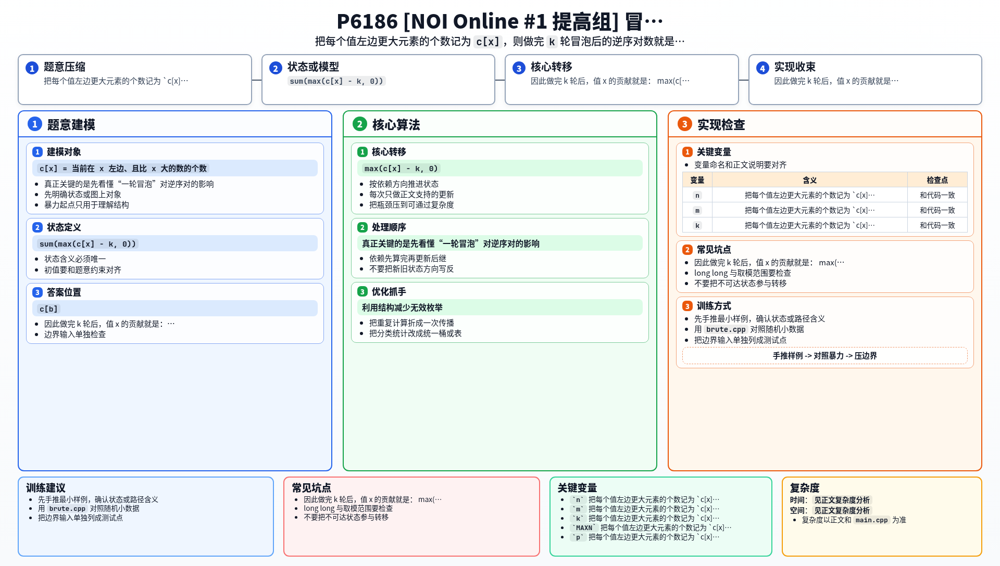

[[TOC]]

### 题意

给出一个 `1..n` 的排列。

操作有两种：

1. 交换当前位置 `x` 和 `x+1` 上的两个数
2. 询问当前排列做完 `k` 轮标准冒泡排序后，还剩多少个逆序对

### 思路

先看一个可以直接验证想法的朴素解：

@include-code(./brute.cpp, cpp)

`brute.cpp` 每次询问都直接复制当前排列，模拟 `k` 轮冒泡，然后再暴力数逆序对。

这个做法只能处理很小的数据。

真正关键的是先看懂“一轮冒泡”对逆序对的影响。

对每个值 `x`，记：

- `c[x] = 当前在 x 左边、且比 x 大的数的个数`

这就等于值 `x` 参与的逆序对数量。

一轮冒泡时，`x` 最多只能向左跨过一个更大的相邻元素，所以它的贡献最多减少 `1`。

因此做完 `k` 轮后，值 `x` 的贡献就是：

`max(c[x] - k, 0)`

总答案自然就是：

`sum(max(c[x] - k, 0))`

于是问题变成两件事：

1. 当前每个 `c[x]` 是多少
2. 相邻交换后它们如何变化

相邻交换只会影响一对相邻数的大小关系：

- 如果交换的是顺序对 `a < b`，那么 `c[a]` 增加 `1`
- 如果交换的是逆序对 `a > b`，那么 `c[b]` 减少 `1`

也就是说，每次交换只改动一个 `c[x]`。

接着按 `c[x]` 的大小维护两棵树状数组：

- 一棵统计每个 `c` 值出现了多少次
- 一棵统计这些 `c` 值的总和

查询 `k` 时，只统计所有 `c[x] > k` 的值即可。

### 代码

@include-code(./main.cpp, cpp)

### 复杂度

- 初始预处理：`O(n log n)`
- 每次交换：`O(log n)`
- 每次询问：`O(log n)`

总复杂度：

`O((n + m) log n)`

空间复杂度：

`O(n)`

### 总结

这题最难的不是数据结构，而是先把“冒泡若干轮后的逆序对”改写成：

- 每个值独立贡献
- `sum(max(c[x]-k,0))`

一旦得到这个式子，后面的在线交换维护就顺了。

### 一图流解析

这张图把本题的建模、关键转移、实现检查和训练方法压缩到一页，适合读完正文后复盘。

