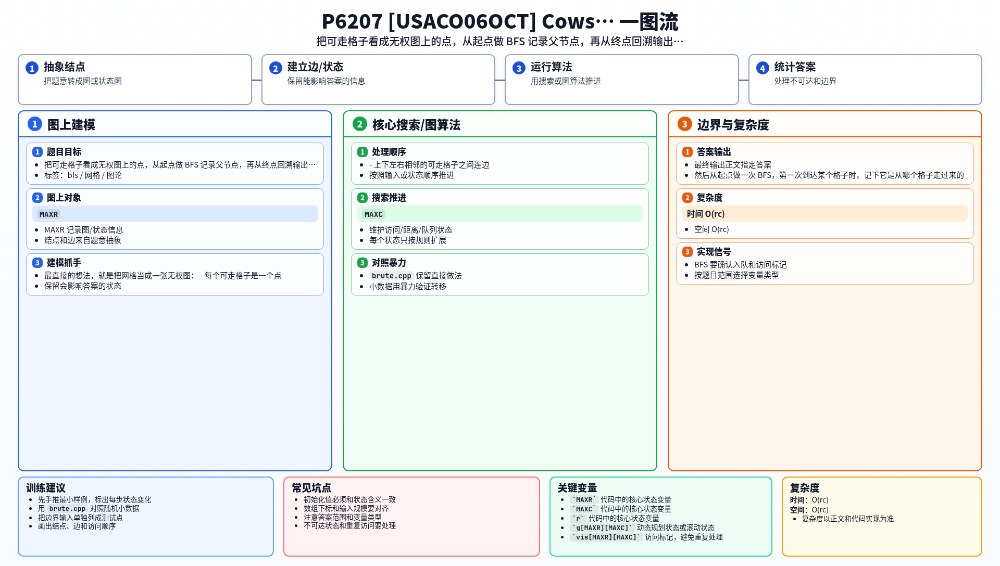

[[TOC]]

### 题意

给出一个 `r × c` 的网格，其中：

- `.` 表示可以走；
- `*` 表示不能走。

从左上角 `(1,1)` 出发，每次可以走到上下左右四个相邻格子之一。题目保证一定存在至少一条路径到达右下角 `(r,c)`。

要求输出任意一条可行路径，并且步数不超过 `10^5`。

### 思路

最直接的想法，就是把网格当成一张无权图：

- 每个可走格子是一个点；
- 上下左右相邻的可走格子之间连边。

然后从起点做一次 BFS，第一次到达某个格子时，记下它是从哪个格子走过来的。

这个最直接、最适合帮助理解题意的版本如下：

@include-code(./brute.cpp, cpp)

#### 为什么 BFS 足够

题目不要求最短路，只要求输出任意一条可行路径。

而 BFS 从起点出发，一旦访问到终点，就已经找到一条合法路径了。

同时，由于 BFS 记录的是父节点链，最终回溯出来的还是一条简单路径，不会出现重复绕圈，所以路径长度至多是格子数级别，远小于 `10^5`。

#### 怎样恢复路径

设某个格子 `(x,y)` 第一次被访问时，是从 `(px,py)` 走过来的，那么就记录：

- `pre_x[x][y] = px`
- `pre_y[x][y] = py`

等 BFS 结束后，从终点 `(r,c)` 反向不断跳到父节点，直到回到起点 `(1,1)`，再把整条序列反转输出即可。

### 代码

@include-code(./main.cpp, cpp)

### 复杂度

- 时间复杂度：`O(rc)`
- 空间复杂度：`O(rc)`

每个格子最多进队一次，每次只检查四个方向。

### 总结

这题本质就是最基础的网格 BFS 路径恢复。

核心只有两步：

1. BFS 找到终点；
2. 用父节点数组把路径倒着找回来。

### 一图流解析

这张图把本题的建模、关键转移、实现检查和训练方法压缩到一页，适合读完正文后复盘。

