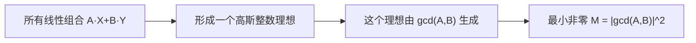

[[TOC]]

### 题意

给定 `a,b,c,d`，要求找到一组整数 `p,q,r,s`，使下面这个值的非零最小值尽量小：

`M = | ... |`

注意输出顺序是：

- `p q r s M`

也就是最小值 `M` 在最后。

### 思路

先看一个最直接的小数据暴力：

@include-code(./brute.cpp, cpp)

暴力版就是在一个很小的范围里枚举 `p,q,r,s`，直接代公式算出 `M`。  
这当然只能用来帮助理解和对拍，根本不可能应付正式数据。

这题真正的关键，是把那个长式子认成一个**高斯整数范数**。

设：

- `A = a + bi`
- `B = c + di`
- `X = p - qi`
- `Y = r + si`

那么原式恰好就是：

`M = |A X + B Y|^2`

也就是说，我们实际上是在问：

- `A X + B Y` 能取到的非零复整数里，范数最小的是谁

而高斯整数环是欧几里得整环，所以由 `A` 和 `B` 生成的所有线性组合：

- `A X + B Y`

构成一个主理想，它由高斯整数 gcd 生成。

于是最小非零范数，正好就是：

- `gcd(A, B)` 的范数

这张图表达的就是这个关系：

图里真正重要的是：  
我们不再直接找 `p,q,r,s`，而是先去找高斯整数里的 gcd。  
一旦求出了贝祖系数：

- `A X + B Y = g`

就能直接从 `X,Y` 反推出 `p,q,r,s`。

还有一个实现细节：  
高斯整数 gcd 只差一个单位元 `±1, ±i` 都是同一个答案。  
为了让本地样例输出稳定，代码里会把这 `4` 组等价答案都试一遍，固定选字典序最大的那组输出。

### 代码

@include-code(./main.cpp, cpp)

### 复杂度

高斯整数 exgcd 的复杂度和普通 exgcd 类似，取决于欧几里得算法的轮数。  
在本题数据范围内可以看作对数级。

空间复杂度：

- `O(1)`

### 总结

这题最难的地方不是实现，而是第一眼认公式。

一旦看出：

- `M = |(a+bi)(p-qi) + (c+di)(r+si)|^2`

后面就变成一题高斯整数 gcd / 贝祖系数模板题了。
